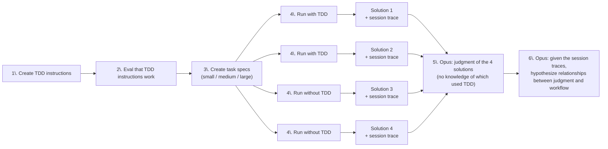

# Comparing solutions created with and without TDD

Companion repository to an upcoming write-up.

The TDD (test-driven development) workflow can be used with AI-augmented coding in these ways:
1. Human writes the tests: A human defines the test scenarios in some form, be it in natural language, in BDD style, or directly in code. Then AI writes the implementation for those tests (with maybe a first step that transforms the human's scenarios into code).
2. Review checkpoint for the human: AI writes a failing test, human looks at it to review that the test is testing the wanted behavior, then AI writes the implementation
3. Fully inside the agentic loop: Prompt an agent to write failing tests first, one by one, and then write the implementation and check that the previously failing test is green.

I've been really skeptical of that last usage, a TDD workflow fully inside the agentic loop, and if it really provides any value, or if it's one of the rare examples so far where what's good for the human might be irrelevant for a coding agent.

I created a very cursory and superficial evaluation setup to explore this question and see what I would find, the results are in this repo

*This is not a comprehensive and structured eval result!* 

But it did give me some interesting hypotheses to think about.

## Evaluation approach

For each task size (small / medium / large), the task is run four times —
twice with TDD instructions, twice without — producing four solutions.
I then had those compared and judged by Opus.

All prompts used are in [`instructions.ts`](instructions.ts)
