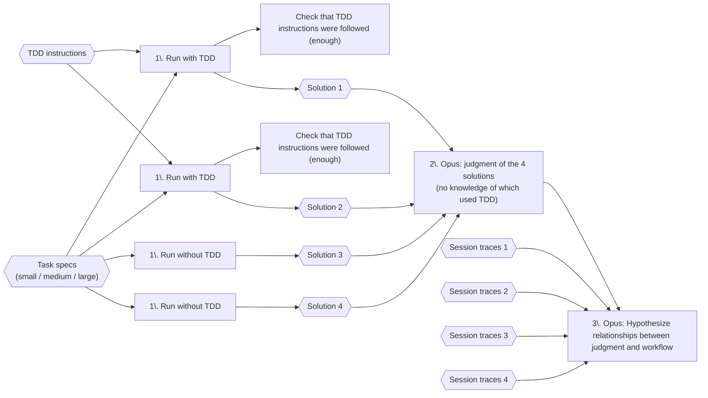

# Comparing solutions created with and without TDD

Companion repository to an upcoming write-up.

Code that created the solutions in these results is [here](https://github.com/birgitta410/local-coding-evals/tree/tdd).

*This is not a comprehensive and structured eval result!* 

But it did give me some interesting hypotheses to think about.

## Evaluation approach

For each task size (small / medium / large), the task is run four times —
twice with TDD instructions, twice without — producing four solutions.
I then had those compared and judged by Opus.

All prompts used are in [`instructions.ts`](instructions.ts)

## Results

- NT* = No TDD instructions
- T* = TDD instructions
- TF* = Test-first instructions

### [tdd-analysis-01-medium](tdd-analysis-01-medium)

**Task:** Build a 4-stage Python pipeline (parse → aggregate → format → validate) that transforms raw `ROW_ID:CATEGORY:VALUE:PERIOD` strings into a plain-text report.

| Rank | ID | TDD | Design | Code | Tests | Avg | Test Count | Coverage | Mutation Score | Total Tokens | Turns | Tool Calls | Verdict |
|------|----|-----|--------|------|-------|-----|------------|----------|----------------|--------------|-------|------------|---------|
| 🥇 1 | NT1 | No | — | — | — | — | 75 | 100% | 84.2% | 769,814 | 31 | 37 | Module-per-stage, dataclasses, `Decimal`; no correctness bugs, strongest error handling, only solution checking duplicate ROW_IDs; validation self-referential but harmless |
| 🥈 2 | NT2 | No | — | — | — | — | 107 | 100% | 89.6% | 703,159 | 21 | 24 | Module-per-stage, dataclasses, float/round; best-engineered and largest suite, but validator rejects its own valid fractional output (false-rejection bug); TOTAL row never validated |
| 🥉 3 | T1 | Yes | — | — | — | — | 30 | 100% | 81.0% | 1,519,762 | 71 | 28 | Single module, dicts, float; correct core stages but validation is circular (re-runs formatter); accepts `nan`/`inf`, ignores duplicate ROW_IDs |
| 4 | T2 | Yes | — | — | — | — | 34 | 99% | 77.3% | 2,580,897 | 103 | 60 | Single module, dicts, float; active TOTAL-row bug (headcount summed into dollars) enshrined by a test; missing validation check #3 entirely |

### [tdd-analysis-01-medium-redo](tdd-analysis-01-medium-redo)

**Task:** Same 4-stage report pipeline as 01-medium, rerun with stricter TDD adherence and a new test-first condition added (NT1/NT2 reuse the same codebases from 01-medium).

| Rank | ID | Approach | Design | Code | Tests | Avg | Test Count | Coverage | Impl/Test LOC | Total Tokens | Turns | Tool Calls | Verdict |
|------|----|----------|--------|------|-------|-----|------------|----------|---------------|--------------|-------|------------|---------|
| 🥇 1 | NT1 | No TDD | 8 | 8 | 8 | 8.0 | 107 | 100% | 497 / 881 | 703,159 | 21 | 20 | Deepest suite, cleanest validation reusing formatter's layout; HEADCOUNT mixed into dollar totals unguarded by tests |
| 🥈 2 | TF2 | Test-first | 8 | 8 | 7 | 8.0 | 90 | 92% | 484 / 850 | 619,531 | 27 | 26 | `Decimal` throughout, strong parse/validate; check 3 is unreachable dead code, validate module cluttered |
| 🥉 3 | NT2 | No TDD | 8 | 8 | 7 | 7.5 | 75 | 100% | 330 / 430 | 769,814 | 31 | 30 | Clean design, `Decimal`, correct parse; thinner tests, one no-op test, validation self-referential |
| 4 | T2 | TDD | 7 | 7 | 6 | 6.5 | 29 | 98% | 207 / 304 | 2,099,280 | 96 | 95 | Clean happy path, correct formatting; crashes on malformed input instead of returning structured parse errors |
| 5 | TF1 | Test-first | 6 | 6 | 6 | 6.0 | 62 | 99% | 348 / 360 | 268,323 | 17 | 16 | Strongest parser of the single-file solutions; broken TOTAL row (headcount as dollars), dead scaffolding shipped |
| 6 | T1 | TDD | 6 | 6 | 6 | 6.0 | 25 | 100% | 142 / 228 | 2,017,739 | 90 | 89 | Most compact (142 LOC); crashes on malformed input, most tautological validation, thinnest test suite |

### [tdd-analysis-02-small](tdd-analysis-02-small)

**Task:** Build a Python module that validates medical appointment slot codes in `DAY-TIME-ROOM-CHECKSUM` format, returning a structured result identifying which rule failed and why.

| Rank | ID | TDD | Design | Code | Tests | Avg | Test Count | Coverage | Mutation Score | Total Tokens | Turns | Tool Calls | Verdict |
|------|----|-----|--------|------|-------|-----|------------|----------|----------------|--------------|-------|------------|---------|
| 🥇 1 | NT1 | No | 8 | 9 | 9 | 8.67 | 61 | 100% | 89.6% | 122,108 | 10 | 15 | Best overall — dataclass result, no bugs, 61 reason-asserting tests |
| 🥈 2 | NT2 | No | 8 | 8 | 8 | 8.0 | 58 | 100% | 92.3% | 117,522 | 10 | 20 | Very close — dataclass result, but a Unicode-digit spec deviation |
| 🥉 3 | T1 | Yes | 7 | 8 | 7 | 7.33 | 21 | 100% | 93.6% | 894,451 | 55 | 37 | Correct & clean, but dict result + fewer tests + dead code |
| 4 | T2 | Yes | 6 | 7 | 7 | 6.67 | 20 | 100% | 93.2% | 1,142,039 | 68 | 26 | Weakest design (free-text error) + a genuine crash bug |

### [tdd-analysis-03-large](tdd-analysis-03-large)

**Task:** Build an in-memory Python loyalty points engine with tiered earn rates (Bronze/Silver/Gold), trailing-365-day spend tracking for tier recalculation, and point redemption.

| Rank | ID | TDD | Design | Code | Tests | Correctness | Avg | Test Count | Coverage | Mutation Score | Total Tokens | Turns | Tool Calls | Verdict |
|------|----|-----|--------|------|-------|-------------|-----|------------|----------|----------------|--------------|-------|------------|---------|
| 1 | NT2 | No | 8 | 9 | 8 | 8 | 8.25 | 69 | 100% | 86.9% | 322,148 | 14 | 13 | Only solution with real input validation; precise boundary tests; minor out-of-order purchase edge cases only |
| 2 | T2 | Yes | 7 | 7 | 8 | 8 | 7.5 | 22 | 99% | 85.6% | 1,225,517 | 63 | 62 | Clean typed data model, all core rules correct; no error handling, duplicate purchase ID bug, dead state fields |
| 3 | T1 | Yes | 7 | 7 | 7 | 9 | 7.5 | 21 | 99% | 85.2% | 1,253,300 | 67 | 66 | Most functionally correct (no bugs found on probing); untyped nested dicts, vestigial structure, fewest tests |
| 4 | NT1 | No | 8 | 7 | 6 | 6 | 6.75 | 74 | 99% | 89.4% | 185,094 | 11 | 9 | Highest design score, 74 tests — but two High bugs: wrong batch draw-down order; future-dated points counted as spendable |

### [tdd-analysis-04-medium-v2](tdd-analysis-04-medium-v2)

**Task:** Same 4-stage report pipeline as 01-medium, rerun with an improved TDD prompt (emphasising upfront design and refactoring); NT1/NT2 again reuse the 01-medium codebases.

| Rank | ID | TDD | Design | Code | Tests | Avg | Test Count | Coverage | Mutation Score | Total Tokens | Turns | Tool Calls | Headline weakness |
|------|----|-----|--------|------|-------|-----|------------|----------|----------------|--------------|-------|------------|-------------------|
| 🥇 1 | T1 | Yes | 8 | 8 | 7 | 7.67 | 51 | 100% | 90.2% | 3,447,283 | 117 | 116 | HEADCOUNT-only TOTAL row printed as `$`; validation is a substring check, not arithmetic |
| 🥈 2 | NT1 | No | 8 | 8 | 6 | 7.33 | 107 | 100% | 89.6% | 703,159 | 21 | 20 | Fractional HEADCOUNT → spurious ValidationError on valid input; tests lean on monkeypatching |
| 🥉 3 | NT2 | No | 8 | 7 | 6 | 7.0 | 75 | 100% | 84.2% | 769,814 | 31 | 30 | `NaN`/`Infinity` crash the pipeline instead of a ParseError; validation re-runs the formatter |
| 4 | T2 | Yes | 7 | 7 | 6 | 6.67 | 43 | 100% | 81.1% | 1,421,671 | 61 | 60 | Validation is tautological (checks aggregate against itself); width check is only a comment |
