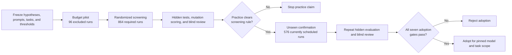
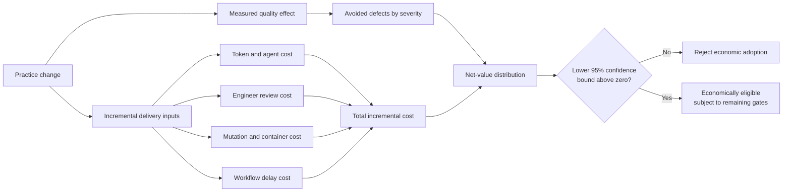

# Methodology Update: From Exploratory Comparison to Decision-Grade Test

## Recommendation

Use the revised ablation study to decide which engineering practices to adopt. Keep the initial TDD comparison as exploratory evidence only.

Initial work generated a small set of solutions with and without TDD instructions, ranked code quality, then used session traces to explain observed differences. That work surfaced useful hypotheses. It could not isolate which practice caused an outcome, estimate uncertainty across varied tasks, or defend an adoption decision to a skeptical engineering or finance leader.

Revised test separates eight process conditions, freezes decision rules before execution, and measures quality, severe defects, delivery cost, and reviewer effort. If executed as specified, it can answer a narrower and more valuable question: which parts of TDD pay for themselves under a pinned model, task portfolio, and operating budget?

## What Changed

| Decision factor | Initial comparison | Revised test | Why revised evidence carries more weight |
|---|---|---|---|
| Process variable | Broad TDD versus no-TDD instruction | Eight conditions isolate tests-required, tests-after, batch test-first, red-green cycles, contract design, and refactoring checkpoints | Attributes observed effect to specific practice instead of broad label |
| Task coverage | Small, medium, and large examples | 12 screening tasks across six families, followed by 12 unseen confirmation tasks | Reduces risk that one task shape determines conclusion |
| Replication | Two runs per treatment for each task size | Frozen repetitions for every task-condition cell, balanced across three prompt variants | Measures run-to-run variance and prompt sensitivity |
| Assignment | Small manual comparison set | Randomized execution order and prompt allocation | Reduces ordering and operator effects |
| Scoring | Model ranking plus tests, coverage, and mutation observations | Severity-weighted hidden tests as primary metric; mutation, coverage, design review, and cost as secondary metrics | Grounds primary claim in business behavior and defect severity |
| Review | Model judge compares solutions | Two blinded reviewers use frozen rubric; reliability thresholds trigger rescoring | Reduces condition-label and reviewer-consistency bias |
| Budget | Observed token and tool-use differences | One shared token ceiling and timeout, frozen from excluded pilot runs | Prevents one condition from receiving more completion opportunity |
| Statistics | Rankings and qualitative interpretation | Paired task effects, task-cluster bootstrap, confidence intervals, Holm-Bonferroni correction, and prompt-interaction test | Quantifies uncertainty and limits false-positive claims |
| Decision rule | Relative ranking | Quality, severe-defect risk, economics, censoring, interaction, and sample-size gates must all pass | Converts result into controlled adoption decision |
| Reproducibility | Stored solution and trace files | Frozen prompts, task manifests, schedules, hashes, run manifests, and repeated report generation | Gives independent operator evidence trail to audit |



## Why Test Is Better

Revised design removes four major sources of ambiguity.

First, it separates practices that initial test bundled together. A stronger result under “TDD” could come from writing any tests, writing tests first, working in short red-green cycles, designing contracts before coding, or pausing to refactor. Eight conditions measure those mechanisms separately. Engineering leaders can adopt one practice without funding entire ceremony.

Second, it tests generalization across task families and unseen confirmation tasks. Initial examples showed what happened on selected coding problems. Revised portfolio spans parsing, state transitions, concurrency, API contracts, transformations, and defect repair. Confirmation then uses unseen tasks. A practice must repeat its effect outside screening set before earning broad claim.

Third, it replaces ranking with thresholds tied to operational outcomes. Severity-weighted hidden-test score measures whether solution satisfies business behavior. Severe-defect risk guards against trading average quality for occasional costly failures. Token cost, elapsed time, human review minutes, and workflow delay expose whether quality gain pays for execution overhead.

Fourth, it treats prompt wording as experimental factor. Three equivalent prompt variants test whether outcome follows practice or one favorable phrasing. Material condition-by-variant interaction blocks broad claim until replication.

## Basis for Methodology

Methodology rests on five controls.

### Pre-registration fixes decision rules before results exist

Eight hypotheses define baseline, treatment, primary metric, direction, minimum useful effect, alpha, power, and multiplicity treatment. Confirmation cannot lower thresholds after seeing screening results. Current frozen quality threshold requires at least five percentage points of point effect.

### Pairing controls task difficulty

Treatment and baseline run against same task set. Analysis computes treatment-minus-baseline effect within each task before aggregating across tasks. Task-cluster bootstrap resamples paired task effects with replacement, preserving repeated clusters and producing confidence interval around mean effect.

### Hidden evaluation separates generation from judgment

Coding agent receives public specification but cannot access hidden evaluators. Hidden tests map to frozen business behaviors and severity levels. Critical and high failures carry more weight than presentation defects. Mutation testing measures whether submitted tests detect seeded code changes, while line coverage remains diagnostic rather than adoption proof.

### Blinding controls reviewer bias

Review packets remove condition identifiers, prompt text, traces, run metadata, and naming clues. Reviewers score same dimensions with frozen rubric. Severity calibration requires weighted Cohen's kappa of at least 0.80; design review requires reliability of at least 0.70. Scores below threshold trigger full independent rescoring before unblinding.

### Fail-closed gates prevent optimistic interpretation

Timed-out and budget-exhausted runs remain in primary intention-to-treat analysis. More than 10 percent censoring in any condition triggers protocol review. Prompt interaction, insufficient sample size, non-positive economic confidence bound, or unsafe severe-defect confidence bound blocks adoption.

## Basis for Adoption Decision

Adoption requires every confirmation criterion below:

1. Quality confidence interval lower bound exceeds zero.
2. Quality point estimate reaches at least 0.05.
3. Severe-defect risk-ratio upper confidence bound stays below 1.10.
4. Economic net-value lower confidence bound exceeds zero.
5. Censoring remains within protocol threshold.
6. Prompt interaction does not block broad claim.
7. Analyzed run count meets frozen sample requirement.

Economic value uses:

```text
avoided defect cost
- agent execution cost
- engineer review cost
- workflow delay cost
```

This rule favors conservative adoption. Practice can raise average quality and still fail adoption if severe failures increase, cost interval crosses zero, or effect depends on prompt wording.

## Cost Implications

Revised test costs more to execute than initial comparison because it buys replication, task coverage, hidden evaluation, mutation testing, and independent review. Cost question has two layers: what study costs to run, and whether adopted practice saves more than it costs in delivery.

Using frozen power-analysis requirement for screening and current confirmation schedule, main study contains 1,440 runs. Shared ceiling permits up to 74,400 tokens and 756 seconds per run. Maximum main-study exposure therefore equals 107.136 million tokens and 302.4 sequential runtime hours. These figures are caps, not forecasts. Actual consumption must come from run manifests.

Pilot adds 96 excluded runs. Those runs do not affect treatment estimates, but they still consume model, compute, and operator resources. Mutation execution, container runtime, reviewer calibration, artifact review, adjudication, and failed-run investigation add cost outside token ceiling.

| Cost input | Known basis | Finance input still required |
|---|---|---|
| Agent execution | Tokens and elapsed time captured per run | Contracted price by model and billing unit |
| Engineer review | Review minutes captured per packet | Loaded labor rate by reviewer role |
| Mutation and container execution | Runtime captured per evaluation | Compute price per runtime hour |
| Workflow delay | Elapsed hours between task start and accepted result | Cost of delay per hour or business day |
| Avoided defects | Difference in critical and high defects versus baseline | Defect cost by severity and production context |



Economic comparison must use incremental values against matched baseline. For condition 6c versus condition 5, count only extra tokens, time, review, and delay attributable to contract design and refactoring instructions. Credit only defects avoided relative to same task baseline. This prevents total project cost from being mistaken for practice cost.

No defensible dollar ROI exists yet. Repository contains no completed run manifests, measured review minutes, compute invoices, or approved defect-cost schedule. Cost model code exists, while test fixture prices are synthetic and must not become business assumptions.

## Evidence Status as of August 13, 2026

Toolkit code and contract tests are ready. Fresh default test run collected 97 product tests and passed all 97. Validation, report loading, blind artifact handling, skipped-test scoring, paired bootstrap logic, prompt-interaction analysis, and test discovery have regression coverage.

Experiment itself is not complete. Repository currently contains schedules and summary claims, but run and result directories are empty:

- `study/screening/runs`
- `study/screening/results`
- `study/confirmation/runs`
- `study/confirmation/results`

Current screening audit reports 576 completed runs without corresponding run artifacts. Current final report states `ADOPT` without underlying run-level evidence. Treat both as placeholders until persisted artifacts reproduce those numbers.

Power analysis also requires correction before execution. Frozen file calculates nine repetitions per screening task-condition cell and 864 total screening runs, while current screening schedule contains six repetitions per cell and 576 runs. Use 864-run requirement or formally amend pre-registration before first production run. Do not silently proceed with smaller schedule.

## Evidence Required Before Final Claim

- Generate power-compliant screening schedule and record any formal protocol amendment.
- Execute every scheduled run in fresh isolated workspace under shared token and time limits.
- Persist immutable source artifacts, manifests, exit status, token counts, duration, tool calls, and hashes.
- Run hidden evaluators and store JUnit results for every run.
- Run pinned `mutmut==3.6.0` protocol and preserve per-mutant evidence.
- Produce blinded review packets, independent scores, reliability calculations, and adjudications.
- Recalculate screening promotions from run-level evidence.
- Execute confirmation on unseen tasks using frozen matched comparisons.
- Apply all seven adoption gates from persisted data.
- Generate final report twice and verify identical output hashes.

Until those steps finish, defensible conclusion is limited: revised methodology can produce stronger evidence than initial comparison, but repository does not yet contain evidence needed for final TDD adoption claim.
