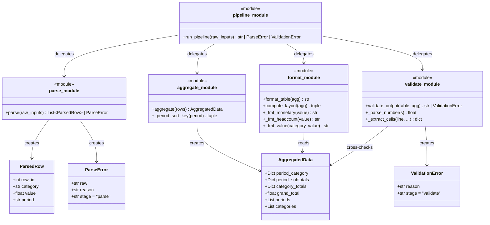

# TDD Evaluation Report – tdd-medium-no (1783512340492)

## Summary

The agent built a Python `report_pipeline` module that transforms raw report data through a 4-stage formatting pipeline. All 107 tests pass with **100% line coverage**.

---

## 1. Solution Description

### Class / Module Diagram



### Module Descriptions

| Module | Role |
|---|---|
| `parse.py` | Parses `ROW_ID:CATEGORY:VALUE:PERIOD` strings into `ParsedRow` dataclasses; returns `ParseError` on first bad input |
| `aggregate.py` | Groups/sums parsed rows into an `AggregatedData` object with per-period, per-category and grand totals |
| `format.py` | Renders `AggregatedData` into a right-aligned, space-separated plain-text table with `$` formatting for monetary values |
| `validate.py` | Cross-checks the formatted table string against the aggregated data (period columns present, totals match, column widths valid) |
| `pipeline.py` | Orchestrates all four stages; short-circuits and returns the first error encountered |

---

## 2. Testing Approach


- Final state: **107 tests, 100% line coverage** across all modules

### Test Organization

Tests are organized into 5 test files mirroring the 5 modules, with meaningful class groupings:

- `test_parse.py` – 26 tests, flat functions, grouped by concern (happy path, field count, ROW_ID, CATEGORY, VALUE, PERIOD, error reporting)
- `test_aggregate.py` – 12 tests, flat functions
- `test_format.py` – 29 tests, split into `TestFormatters` (unit testing format helpers) and `TestTableStructure` (integration-level)
- `test_validate.py` – 21 tests, split into `TestParseNumber`, `TestValidatePass`, `TestValidateFail`
- `test_pipeline.py` – 19 tests, split into `TestRunPipelineSuccess` and `TestRunPipelineParseErrors`

---

## 3. Test Quality Analysis

### ✅ Strengths

**Expressive, well-named tests**  
Names like `test_aggregate_period_ordering_across_years`, `test_parse_duplicate_row_id`, and `test_total_mismatch_in_row` clearly communicate intent. No generic names like `test_1` or `test_validate`.

**Good use of test helpers**  
Both `test_format.py` and `test_validate.py` define `_make_agg(*raw_rows)` helper factories that create realistic aggregated data from tuples without duplicating boilerplate. `test_aggregate.py` uses a compact `_row()` helper.

**Realistic and varied test data**  
The tests use plausible domain values: YYYY-QN period strings, monetary amounts with decimals, multi-period/multi-category scenarios, cross-year ordering, etc. Edge cases include zero values, large numbers (`$1,000,000`), negative costs, and all four quarters.

**No unnecessary mocking in happy-path tests**  
Pipeline tests call `run_pipeline()` end-to-end without any mocking. Format and validate tests use real `aggregate()` output. This increases confidence that the full chain works together.

**Good error path coverage**  
Parse error tests systematically cover all validation rules: wrong field counts, all invalid ROW_ID forms (non-integer, zero, negative, float, duplicate), invalid CATEGORY casing, non-numeric VALUE, negative REVENUE/HEADCOUNT, all PERIOD format violations.

**Meaningful assertions**  
Assertions check specific content (e.g., `"$1,234.56" in result`, `header.index("2024-Q1") < header.index("2024-Q3")`) rather than just checking that a return value is truthy.

---

### ⚠️ Concerns

**Monkeypatching of private implementation internals in validate tests**  
Several `TestValidateFail` tests patch private functions (`compute_layout`, `_extract_cells`, `_parse_number`) to inject failures:

```python
vmod.compute_layout = bad_layout  # returns negative label_width
vmod._extract_cells = bad_extract  # raises RuntimeError
vmod._parse_number = bad_parse    # raises ValueError on 2nd call
```

These tests are brittle – if the implementation renames these functions or restructures the control flow, the tests break even though the behavior is unchanged. They also reveal intimate knowledge of internal module structure. The exception paths they're testing (e.g., `_extract_cells` raising) are arguably defensive guards that might not correspond to any realistic failure scenario.

**validate happy-path tests are redundant with format tests**  
`TestValidatePass` essentially calls `format_table` followed by `validate_output`. Since the validate stage is designed to cross-check the format stage, always passing on the correct output is expected. These tests add minimal new coverage beyond `test_format.py`.

**Some format tests are trivially structural**  
`test_returns_string`, `test_row_count`, `test_category_row_labels_present` test very basic properties that would be caught by any other test. These add low marginal value.

**`test_values_right_aligned_in_columns` is weak**  
```python
assert rev_line.endswith(rev_line.rstrip())  # no trailing spaces needed
```
This assertion is almost a tautology (it only checks that there are no trailing spaces, which tells us almost nothing about right-alignment of individual columns).

**No test for empty-period scenario in aggregate**  
There's no test for `aggregate([])` (empty input), even though `parse([])` returning `[]` is tested and `run_pipeline([])` passes through.

---

### Summary Table

| Dimension | Rating |
|---|---|
| Test naming and readability | ⭐⭐⭐⭐⭐ Excellent |
| Assertion meaningfulness | ⭐⭐⭐⭐ Very good (a few weak) |
| Coverage (line) | ⭐⭐⭐⭐⭐ 100% |
| Client perspective (not over-coupled to internals) | ⭐⭐⭐ Mixed – monkeypatching is brittle |
| Realistic test data | ⭐⭐⭐⭐⭐ Excellent |
| Mock appropriateness | ⭐⭐⭐ Used only in validate failure tests; somewhat undermines test value there |
| TDD discipline | ❌ Tests written after implementation |
| Overall test quality | ⭐⭐⭐⭐ Very good |
