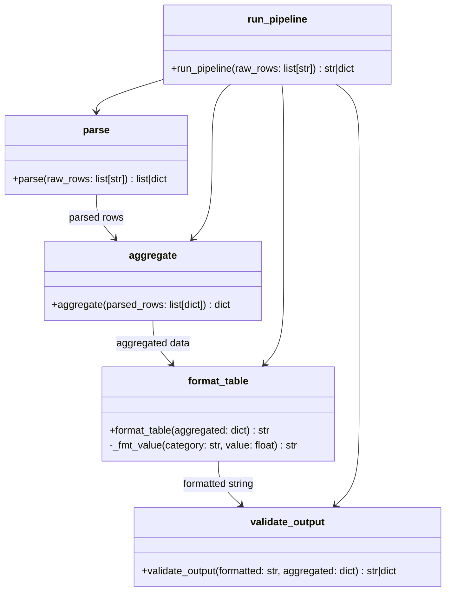

# TDD Analysis Report — `tdd-medium_2026-07-10_14-40-55`

## 1. Solution Summary

### Mermaid Class Diagram

### Solution Description

The solution is a single Python module `report_pipeline/pipeline.py` implementing a 4-stage data transformation pipeline for producing plain-text reports:

1. **`parse(raw_rows)`** — Validates and parses a list of `"ROW_ID:CATEGORY:VALUE:PERIOD"` strings. Validates category (must be REVENUE/COST/HEADCOUNT), period format (`YYYY-Q[1-4]`), and sign constraints (REVENUE and HEADCOUNT cannot be negative). Returns a list of structured dicts or an error dict on first failure.

2. **`aggregate(parsed_rows)`** — Groups parsed rows by PERIOD × CATEGORY, sums values, calculates per-period subtotals and per-category grand totals. Periods are sorted chronologically. Returns a dict with `cells`, `periods`, `period_totals`, and `category_totals`.

3. **`format_table(aggregated)`** — Renders aggregated data into a right-aligned plain-text table with a header row (period columns + TOTAL), one row per category, and a TOTAL row at the bottom. Column widths accommodate the widest value. REVENUE/COST use `$x,xxx.xx` format; negatives use `-$x.xx`; HEADCOUNT is a plain integer.

4. **`validate_output(formatted, aggregated)`** — Verifies: (1) all expected periods appear as column headers, (2) no data column is narrower than its header token, (3) TOTAL column values match recomputed values. Returns the formatted string on success, or an error dict on failure.

5. **`run_pipeline(raw_rows)`** — Chains all 4 stages and returns either the formatted string or the structured error from whichever stage failed.

---

## 2. TDD Process Analysis

### Did the agent follow TDD?

**Yes — very strictly.** The conversation log shows a clear and consistent Red → Green loop for each of the 25 tests:

- **Test written first**: Each new test was appended to `test_pipeline.py` before any corresponding implementation code was written.
- **Run to confirm failure**: After writing each test, `pytest` was immediately run and confirmed to fail (or produce an `ERROR` when the import failed entirely due to a missing function).
- **Minimum implementation written**: Only after a failing test was confirmed did the agent write or edit the implementation.
- **Full suite run**: After each implementation change, the full test suite was re-run to confirm all prior tests still passed.
- **One test at a time**: Every new behavior was introduced by exactly one new test.
- **Coverage monitored**: A mid-session and final coverage check was done; 100% coverage was achieved and maintained.

### Were any tests modified to adapt to the implementation?

**No weakening of tests occurred.** All 27 edits to `test_pipeline.py` can be categorized as:

- **Purely additive** (edits 1–27): Each edit took the last assertion of the current test and appended the next new test below it. The existing assertions were never changed.

One notable moment: around message [163], the agent discovered that its `validate_output` implementation had a structural problem where Check 3 (TOTAL column validation) was dead code because Check 2 used exact string equality for the whole table — meaning Check 3 could never be reached. The agent restructured the implementation to reorder the checks. This required a refactoring, but **no test was changed** — the entire suite of 25 tests continued passing after the refactoring. The agent mentioned "update the test for wrong total" but then ran the tests and found they already passed, so no test changes were made.

---

## 3. Test Quality Analysis

### Are the tests and assertions meaningful?

**Yes.** Each test targets a specific, named behavior from the specification:
- Parsing: valid rows, multiple rows, error cases for each validation rule (negative revenue, negative headcount, invalid period, invalid category), and first-failure semantics.
- Aggregation: summing values, chronological period ordering, period subtotals, category grand totals.
- Formatting: return type, header structure, number formatting (dollar, negative, integer), TOTAL row position, row count, multi-period columns.
- Validation: happy path, missing period error, wrong total error, narrow column error.
- Pipeline: end-to-end success and error propagation.

### Are tests well readable and expressively named?

**Yes.** Test names like `test_parse_error_negative_revenue`, `test_aggregate_periods_sorted_chronologically`, `test_format_negative_cost_format` are clear, descriptive, and follow a consistent `test_{stage}_{behavior}` pattern. Section headers with Unicode box-drawing characters (`# ─── Stage 1: Parse ───`) organize the file visually.

### Do tests behave like good clients of their subject?

**Largely yes.** Tests use the public API (parse, aggregate, format_table, validate_output, run_pipeline) and do not reach into internal state. The `_simple_aggregated()` helper avoids code duplication across format and validate tests.

One mild concern: some tests for `format_table` call `aggregate` internally to build input data (e.g., `test_format_revenue_dollar_format`), meaning a failure in `aggregate` would break format tests. A test fixture or direct construction of aggregated dicts would be more isolated. However, this is a pragmatic and readable choice.

### Test data quality

**Good and realistic.** Values cover:
- Large dollars with thousands separator (`$1,234,567.89`)
- Negative costs (`-$200.00`)
- Zero categories (HEADCOUNT=0 across periods)
- Multiple periods with mixed categories
- Cross-period chronological sorting (`2023-Q4`, `2024-Q1`, `2024-Q3`)
- Tampered tables to force validation failures

### Mocks

**No mocks used.** All tests call real implementations. This is appropriate for a pure-computation module with no I/O or external dependencies.

### Potential Issues / Observations

1. **`test_validate_error_column_narrower_than_header`** is somewhat synthetic — it truncates a data line to 5 characters, which would only happen with a tampered table, not through any normal pipeline failure mode. The check it exercises (`len(line) < col_start`) is for tampered output only, since `format_table` guarantees proper widths. While it achieves the coverage goal, it tests an edge case that can only occur if someone bypasses the pipeline.

2. **`test_validate_error_wrong_total`** works by replacing `"$1,000.00"` in the formatted table with `"$9,999.99"`. This is fragile: if the REVENUE value changes or the formatting changes, the string to replace might not match. A more robust test would construct a deliberately wrong table string from scratch.

3. **`test_validate_error_missing_period`** replaces `"2024-Q1"` with `"XXXX-XX"` everywhere in the table. This works but is brittle to test data changes.

4. **`validate_output` is circular and can never fail on real pipeline output**: Check 3 (`pipeline.py:129`) is meant to verify "the TOTAL column values match the sum of the row's period values", but it does so by re-running the formatter — `expected = format_table(aggregated)` — and comparing `formatted != expected`. In `run_pipeline`, `formatted` was itself produced by `format_table(aggregated)`, so the two sides are identical by construction and the check can never fail. If the formatter had a totals bug, both sides would carry the same bug and still match; the check has no independent source of truth. Check 2 (column width) has the same weakness — a table produced by `format_table` is always well-formed, so it can only be tripped by hand-tampering the string in a test. As a result the entire `validate_output` stage does no real work on the pipeline's own output; it only reacts to externally-mangled tables. (An earlier version of the code was worse still: the equality check ran *before* the column-width check, making the width check unreachable dead code. The agent noticed this around message [163] while trying to write a failing test for it, and reordered the checks — but the reorder only fixed the reachability of Check 2; it left the underlying circularity of Check 3 in place.)

5. **No test for `parse` with a malformed string** (e.g., wrong number of colons, non-integer ROW_ID, non-numeric VALUE). The spec says these are valid inputs to reject, but no error-handling for malformed rows is tested or implemented — `parse` would raise an unhandled exception.

### Overall Assessment

The test suite is well-structured, readable, and meaningfully exercises all specified behaviors. Coverage of 100% reflects thorough incremental test writing. The TDD discipline was followed rigorously. Minor quality issues exist (fragile tamper-based validate tests, some integration coupling), but these do not undermine the fundamental correctness of the solution.
