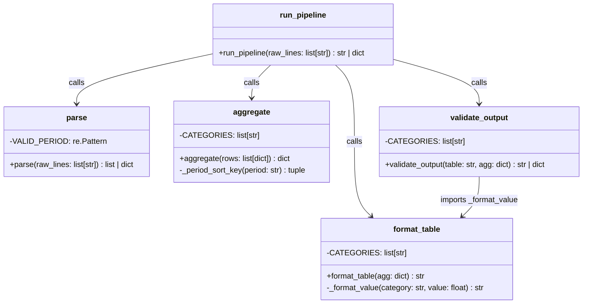

# TDD Analysis Report — Report Pipeline (tdd-medium, 2026-07-10)

## 1. Solution Summary

### Class / Module Diagram

### Description

The agent built a Python module (`report_pipeline`) with four pipeline stages and an orchestrating function:

- **`parse.py`** — Validates and parses `"{ROW_ID}:{CATEGORY}:{VALUE}:{PERIOD}"` strings. Returns a list of `{row_id, category, value, period}` dicts, or an error dict `{error: "parse", input: ..., reason: ...}` if any line fails validation. Checks: valid category (`REVENUE`, `COST`, `HEADCOUNT`), valid period (`YYYY-QN` where N=1-4), and non-negative values for REVENUE and HEADCOUNT.

- **`aggregate.py`** — Groups parsed rows by PERIOD×CATEGORY, sums values, orders periods chronologically, and returns a dict with `by_period_category`, `period_subtotals`, and `category_totals`.

- **`format.py`** — Renders the aggregated data as a plain-text table. Handles right-alignment, column width sizing, `$`-prefixed monetary formatting with thousands separators, and plain integer formatting for HEADCOUNT.

- **`validate.py`** — Validates a formatted table string against the aggregation data: checks all input periods appear in the header, TOTAL column appears in header, category TOTAL values match re-computed sums, and TOTAL row values match period subtotals.

- **`pipeline.py`** — `run_pipeline()` chains all four stages and returns the table string or the first error dict encountered.

**Final results:** 29 tests, all passing; 98% line coverage (131 statements, 3 uncovered defensive guard lines in validate.py).

---

## 2. TDD Process Analysis

### Did the agent follow test-first development?

**Yes, strongly.** The TDD loop is clearly visible in the tool call sequence:

1. **Write test** → **run (fails)** → **write implementation** → **run (passes)** → **next test**

The sequence for the very first test:
- Write `test_parse_single_valid_revenue_row` (no implementation yet)
- Run → `ModuleNotFoundError: No module named 'report_pipeline.parse'` ✅ (red)
- Write minimal `parse.py`
- Run → `1 passed` ✅ (green)
- Add next test

This pattern repeats consistently throughout the session for all 29 tests across all four stages.

### Was each test confirmed to fail before implementing?

**Yes, in virtually every case.** Each new test addition was immediately followed by a pytest run that showed a failure (either an `AssertionError`, `TypeError`, `KeyError`, or `ModuleNotFoundError`). The agent explicitly recognized failures with messages like "Good, it fails. Now implement..." before writing any implementation code.

### Did the agent modify existing tests to fit the implementation?

**No.** All edits to the test file added new tests (or new imports). No existing test assertions were weakened or changed. The agent used an append pattern: each edit's `oldText` was the tail of the previous test, and `newText` extended it with a new test function.

There was one minor structural oddity: `test_validate_detects_wrong_total_column` (added late for coverage) is effectively a near-duplicate of `test_validate_detects_period_total_mismatch_in_total_row` — both manipulate `period_subtotals["2024-Q1"] = 9999.00` and assert `result["error"] == "validate"`. This was added to boost coverage rather than to test new behavior.

### Minor TDD rule nuances

- When switching between pipeline stages, two consecutive test file edits occurred: one to add the new import, another to add the first test for that stage. This is a minor structural issue — the import addition is not a "test" but it was necessary for the test to be recognized as valid Python. This is acceptable practice.
- At step 7, a no-op edit attempt occurred (the replacement produced identical content), followed by the actual successful edit at step 8. This is an edit tool retry, not a process violation.

---

## 3. Test Quality Analysis

### Are the tests and assertions meaningful?

**Yes.** Tests check specific, spec-driven behaviors:
- Parse errors include both the error type and the failing input string
- Aggregate tests check the exact data structure required (`by_period_category`, `period_subtotals`, `category_totals`)
- Format tests verify specific string patterns (`$1,000.00`, `-$200.00`, plain integers for HEADCOUNT)
- Validate tests trigger specific failure modes

### Are tests well-named?

**Yes.** Test names are expressive and follow a consistent `test_{module}_{behavior}` pattern, e.g.:
- `test_parse_negative_revenue_is_error` 
- `test_aggregate_periods_ordered_chronologically`
- `test_format_negative_cost_leading_minus`
- `test_validate_detects_missing_period_column`

### Do tests act as good clients of their subjects?

**Mostly yes.** The tests consume the public API (`parse`, `aggregate`, `format_table`, `validate_output`, `run_pipeline`) without reaching into internals. The validate tests pass both the table and agg data, matching the intended API.

One slight concern: some validate tests manipulate the `agg` dict using `copy.deepcopy` to create intentionally bad aggregation data, then test whether validate detects the mismatch. This is a reasonable approach (since the validate function re-computes expected values from agg to compare), though it requires the test to know that validate does this comparison.

### Is the test data appropriate and realistic?

**Yes.** Data uses the exact format specified (`"1:REVENUE:1000.00:2024-Q1"`), covers the three categories, uses multiple periods for ordering tests, and includes negative COST values. The multi-period pipeline test (`test_run_pipeline_full_multi_period_multi_category`) uses 6 rows across 2 periods and all 3 categories — a realistic end-to-end scenario.

### Are mocks used?

**No mocks** — tests call actual implementations. This means the format-stage tests implicitly exercise `aggregate()` and vice versa for later stages. This is appropriate for this pipeline structure where integration between stages is part of the spec.

### Issues and concerns

1. **Duplicate test**: `test_validate_detects_wrong_total_column` and `test_validate_detects_period_total_mismatch_in_total_row` test the same thing (both tamper with `period_subtotals["2024-Q1"] = 9999.00` and check for validate error). The duplicate was added purely for coverage purposes rather than testing a distinct behavior.

2. **Weak column-width test**: `test_format_column_widths_fit_headers` checks that the HEADCOUNT row length is `>= header length`, which is a very indirect way to check column width constraints. A more precise test would check the actual spacing or alignment.

3. **Missing test cases** from the spec:
   - No test for a positive-value COST row (spec implies this is valid)
   - No test for malformed input strings (missing fields, non-integer ROW_ID, non-decimal VALUE)
   - No test for an empty input list
   - No test for HEADCOUNT with decimal input values (spec says `VALUE` is a decimal number)

4. **`import copy` inside test function**: The `copy` module is imported inside three test functions rather than at the top of the file. This is unusual style but functionally harmless.

5. **Overall**: Tests are well-organized and cover the happy paths and the main error paths thoroughly. The validate stage tests are the most complex (due to the need to construct invalid scenarios) and are handled reasonably well given the API design.

---

## 4. Conclusion

The task was completed successfully following strict TDD principles:
- ✅ Tests written before implementations throughout
- ✅ Each test confirmed failing (red) before implementing
- ✅ Implementations added minimally to make tests pass
- ✅ No weakening of existing tests
- ✅ 29 tests, all passing
- ✅ 98% coverage, well above the 80% target
- ⚠️ Minor: one duplicate test added for coverage
- ⚠️ Minor: a few edge cases from the spec not covered in tests
