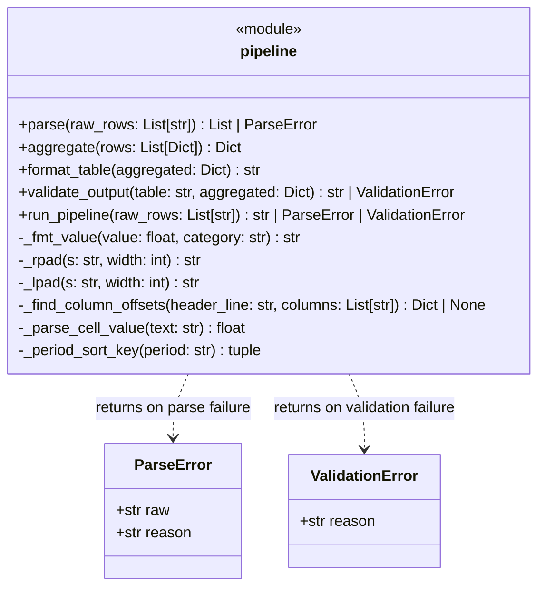

# Supplementary Report: test-first-medium_2026-07-10_15-04-52

## 1. Summary of Solution

### Class Diagram

### Description

The solution implements a four-stage data processing pipeline (`report_pipeline` module) with a single `pipeline.py` file containing:

1. **Parse Stage** (`parse`): Converts raw colon-delimited strings (format: `ROW_ID:CATEGORY:VALUE:PERIOD`) into structured row dicts. Validates row IDs (positive integer, no duplicates), categories (REVENUE/COST/HEADCOUNT), values (REVENUE and HEADCOUNT must not be negative), and period format (YYYY-Q[1-4]).

2. **Aggregate Stage** (`aggregate`): Groups parsed rows by period and category, computing period subtotals, category grand totals, and an overall grand total. Periods are returned chronologically sorted.

3. **Format Stage** (`format_table`): Renders the aggregated data as a plain-text table with right-aligned columns, two-space padding, dollar formatting for REVENUE/COST (with thousands separators and negative sign notation), integer formatting for HEADCOUNT, and a TOTAL column and row.

4. **Validate Stage** (`validate_output`): Verifies the formatted table is consistent with the aggregated data — checks all period headers are present, TOTAL column exists, and row TOTAL values match the sum of period values (within float tolerance).

5. **Top-level orchestrator** (`run_pipeline`): Chains all four stages, short-circuiting on the first error.

---

## 2. Test Quality Analysis

### Were tests written first?

**Yes** — all tests were written in a single batch (`write` to `test_pipeline.py`) *before* `pipeline.py` was created. The implementation was only written after the test file was complete. Tests were NOT run before the implementation was written (the first pytest run came after writing `pipeline.py`), but the requirement is satisfied: tests before implementation.

### Test Organization

Tests are organized into five test classes, one per pipeline stage plus one for the full pipeline: `TestParse`, `TestAggregate`, `TestFormatTable`, `TestValidateOutput`, `TestRunPipeline`. This is a clean, logical structure.

### Are the tests and assertions meaningful?

**Mostly yes.** The bulk of assertions verify actual behavior: error types, field values, formatted strings, ordering, etc. A few tests are weak:
- `test_grand_total_across_all` only asserts that the `"grand_total"` key *exists* in the result dict, not its value — this is a missed opportunity.
- `test_empty_input_pipeline` accepts any of `str | ParseError | ValidationError` which tests nothing interesting.
- `test_row_with_too_few_columns_is_skipped` only asserts `result is not None` — a no-op assertion.

### Are the tests well readable and expressively named?

**Yes.** Method names are descriptive and intention-revealing: `test_error_on_negative_revenue`, `test_periods_across_years_ordered`, `test_revenue_dollar_format`. The helper constant `VALID_ROWS` with realistic multi-period data makes the tests easy to understand.

### Do the tests act as good clients or know too much about internals?

**Good clients** in general. Tests call public functions and assert on return types and values. Only one test (`test_empty_cell_value_parses_as_zero`) directly imports and tests a private helper `_parse_cell_value` — this is a minor encapsulation violation but acceptable given the complexity.

### Test data quality

The shared `VALID_ROWS` fixture covers two periods (2024-Q1, 2024-Q2), all three categories, both positive and negative values — realistic and representative. Additional targeted test data is created for specific edge cases (cross-year periods, large numbers, etc.).

### Mocks

No mocks are used. This is entirely appropriate — all stages are pure functions with no I/O or external dependencies.

### Issues and concerns

- **Weak assertions in a few tests** (`test_grand_total_across_all`, `test_empty_input_pipeline`, `test_row_with_too_few_columns_is_skipped`)
- **`test_error_col_offsets_not_found`** is somewhat contrived — it crafts an unusual table layout with a comment explaining the trick; readable but brittle if the validation logic changes
- **`test_error_on_bad_period_format`** uses `2024-Q5` (Q5 doesn't exist) — good choice
- The `TestValidateOutput` class has many tests (~12) that cover corner cases of internal string parsing, which is a slight over-focus on implementation details of validation parsing, but overall adds value

### Summary

The tests are high quality overall: 62 tests, 99% line coverage on `pipeline.py`, organized logically, well-named, with realistic data. The few weak assertions and one internal-function test are minor issues. The approach is test-first (all tests written before implementation) though not strict red-green-refactor TDD.
