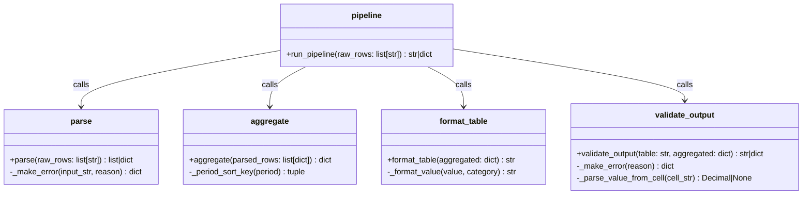

# Supplementary Evaluation Report
**Task:** TDD Report Pipeline — `tdd-2026-07-10_17-11-55`  
**Result file:** `test-first-medium_2026-07-10_15-14-16.json`

---

## 1. Solution Summary

### Class / Module Diagram

### Description

The solution is a 4-stage report-formatting pipeline implemented as a Python package `report_pipeline/`:

| Module | Stage | Role |
|--------|-------|------|
| `parse.py` | 1 – Parse | Converts `"ROW_ID:CATEGORY:VALUE:PERIOD"` strings to structured dicts; validates all fields (positive row IDs, no duplicate IDs, valid categories, non-negative REVENUE/HEADCOUNT, YYYY-QN period format). Returns a structured error dict on first failure. |
| `aggregate.py` | 2 – Aggregate | Groups rows by `(period, category)`, sums `Decimal` values, computes per-period and per-category totals. Periods sorted chronologically; categories in REVENUE → COST → HEADCOUNT order. |
| `format_table.py` | 3 – Format | Renders the aggregated structure as a right-aligned plain-text table. HEADCOUNT as plain integers; REVENUE/COST with `$`, thousands separator, 2 decimal places; negative as `-$x.xx`. Column widths sized to widest entry, separated by ≥2 spaces. |
| `validate_output.py` | 4 – Validate | Checks every period column is present in the header, TOTAL column matches row sums, and no column header is wider than its slot. Returns the table string on success, structured error dict on failure. |
| `pipeline.py` | Full pipeline | Chains all 4 stages; returns first structured error or final table string. |

**Test suite:** 90 tests across 5 test files, all passing.  
**Coverage:** 92% line + branch (individual module breakdown: `parse.py` 100%, `aggregate.py` 100%, `pipeline.py` 100%, `format_table.py` 99%, `validate_output.py` 85%).

---

## 2. TDD Process Analysis

### Were tests written first?

**Yes — clearly.** The tool call sequence in the conversation is:

1. Setup (ls, install pytest/pytest-cov, mkdir)
2. Write **all test files** (in batch):  
   `tests/__init__.py` → `test_parse.py` → `test_aggregate.py` → `test_format.py` → `test_validate.py` → `test_pipeline.py`
3. Write **all implementation files**:  
   `report_pipeline/__init__.py` → `parse.py` → `aggregate.py` → `format_table.py` → `validate_output.py` → `pipeline.py`
4. Run tests (some failures initially in validate/format)
5. Fix `format_table.py` edge case + expand `test_validate.py` with edge cases
6. Final coverage run: 90 tests passing, 92% coverage

**Style:** All tests were written upfront in one batch (not one-by-one TDD red-green-refactor). No intermediate test run between writing tests and writing implementation — the agent wrote everything then ran tests. The requirement was only to write tests before implementation, which was satisfied.

---

## 3. Test Quality Analysis

### Are the tests and assertions meaningful?

**Mostly yes.** The tests cover:
- All parsing error cases (wrong field count, invalid row_id, duplicate IDs, invalid category, bad value, negative REVENUE/HEADCOUNT, invalid period format)
- Aggregate logic: ordering, summing, edge cases (empty input, missing combinations)
- Format output: dollar formatting, thousands separator, negative formatting, integer headcount, right-alignment, column ordering, TOTAL row/column correctness
- Validation: missing period columns, TOTAL mismatch, TOTAL header missing, empty table, edge cases
- Full pipeline integration for both success and error paths

The assertions generally check the specific behavior, not just "it ran without error." Most assertions are concrete value checks (e.g., `assert result["cells"][("2024-Q1", "REVENUE")] == Decimal("1000")`).

### Are the tests well-named and readable?

**Yes, very well.** Tests use descriptive class names (`TestParseValidInputs`, `TestParseErrors`, `TestAggregateStructure`, etc.) and method names that read as specifications (e.g., `test_negative_revenue_is_error`, `test_sums_multiple_rows_same_period_category`, `test_total_column_mismatch`). The test organization by class groups related behaviors clearly.

### Do tests act as good clients?

**Mostly yes.** Most tests exercise the public API through formatted inputs and check observable outputs. The `make_aggregated` helper (duplicated in `test_format.py` and `test_validate.py`) builds aggregated structures from a dict — this is reasonable but duplicating it instead of importing a shared helper adds slight maintenance overhead.

One slightly internal-knowledge moment: some format tests check specific column positioning logic (e.g., `test_column_width_at_least_header_width` uses `len("REVENUE") + len("2024-Q1")` as a minimum line length), which isn't a precise spec check but is reasonable.

### Appropriate and realistic test data?

**Yes.** Decimal values are realistic (e.g., `"1234.56"`, `"-3000.00"`, `"10000.00"`). Multiple periods (2024-Q1, 2024-Q2, 2023-Q4) are used. The data includes all three categories in combination, negative costs, large numbers. Edge cases (empty input, zero values, missing period-category combinations) are covered.

### Are mocks used?

**No mocks at all.** The tests use real implementations throughout — appropriate given the purely computational nature of the pipeline. The validate tests do use the real `format_table` function to generate valid table inputs, which is a good integration practice. The `test_validate.py` also tests against manually crafted "bad" table strings to simulate error conditions — this is somewhat brittle (the crafted strings must match what the validator parses), but it's an acceptable tradeoff.

### Any issues?

**Minor issues:**
- `test_column_narrower_than_header` in `test_validate.py` creates a manually crafted bad table (`"CAT  2024\nREVENUE  $1,000.00\nTOTAL  $1,000.00"`) that doesn't properly simulate the stated condition (column narrower than header). Instead it tests with a table that doesn't even have the periods in aggregated. The test passes but doesn't really test what it claims to test.
- `test_two_spaces_padding_between_columns` only checks that `"  "` (two spaces) appears somewhere in any line — this is a very weak check.
- `test_values_right_aligned` ends with a comment saying "this is hard to check precisely without knowing column widths" and just verifies `len(lines) >= 2` — effectively a do-nothing assertion.
- `test_total_col_index_out_of_range` just checks `result is not None`, which would never be False.
- The `make_aggregated` helper function is duplicated identically in three test files — a shared `conftest.py` fixture would have been cleaner.
- The validate test for `test_column_narrower_than_header` passes because the bad table triggers a missing-period error first, not the column-width check. The column-width validation code in `validate_output.py` is largely a no-op (the `pass` block) and lines 83, 113-114 etc. are never reached according to coverage.

**Overall assessment:** Good quality tests. Well-named, readable, and covering the main spec behaviors. The weak spots are in some of the validate tests and a few vacuous assertions, but these don't undermine the overall effectiveness of the test suite.
