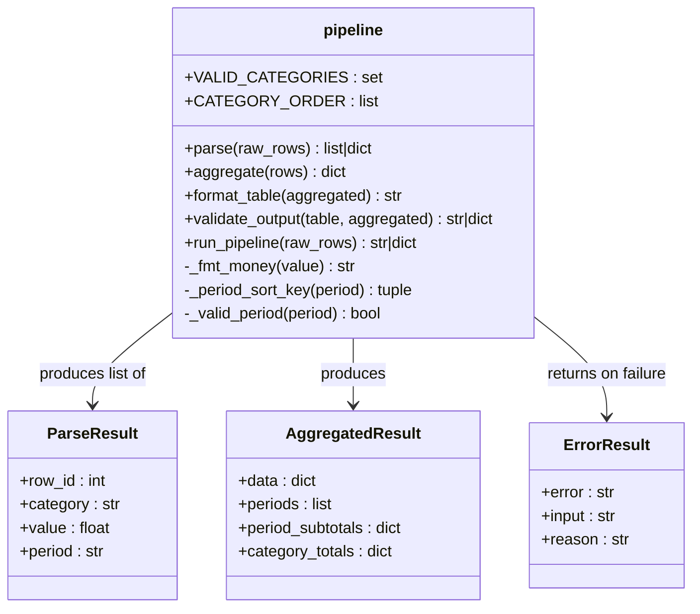

# TDD Analysis Report — `tdd-medium_2026-07-08_12-18-32`

## 1. Solution Summary

### Class / Module Diagram



### Description

The solution is a Python module `report_pipeline/pipeline.py` implementing a 4-stage data transformation pipeline:

1. **`parse(raw_rows)`** — Parses colon-delimited strings `"{ROW_ID}:{CATEGORY}:{VALUE}:{PERIOD}"` into structured dicts. Validates ROW_ID (positive int), CATEGORY (REVENUE/COST/HEADCOUNT), VALUE (float; non-negative for REVENUE and HEADCOUNT), and PERIOD (YYYY-Q[1-4] format). Returns a list of structured dicts or a single structured error dict identifying the failing input and reason.

2. **`aggregate(rows)`** — Groups parsed rows by PERIOD×CATEGORY, sums values. Returns `{ data, periods (sorted chronologically), period_subtotals, category_totals }`.

3. **`format_table(aggregated)`** — Produces a plain-text table with periods in chronological order, category rows (REVENUE→COST→HEADCOUNT), a TOTAL row, right-aligned values in minimum-width columns (≥2 spaces between). REVENUE/COST formatted as `$1,234.56` / `-$200.00`; HEADCOUNT as plain integers.

4. **`validate_output(table, aggregated)`** — Validates that all periods appear as columns, TOTAL column present, and table content matches the freshly regenerated table. Returns the table string on success or a structured error dict.

5. **`run_pipeline(raw_rows)`** — Chains all four stages, returning either the formatted table or the first structured error encountered.

**Tests:** 30 tests in `report_pipeline/tests/test_pipeline.py`  
**Coverage:** 100% line and branch coverage

---

## 3. Test Quality Analysis

### Meaningfulness of assertions
**Good overall.** The assertions are specific and meaningful. Error tests check both `result["error"]` and the `result["reason"]` string content (e.g., `"negative" in result["reason"]`), which is appropriately precise without being brittle to exact wording.

### Readability and naming
**Excellent.** Test names clearly communicate intent:
- `test_parse_error_negative_headcount` → clear what's being tested
- `test_format_table_headcount_integer_format` → precise and descriptive
- `test_run_pipeline_multi_period_ordering` → describes the behavior under test

The tests are organized into clearly labeled sections (Parse, Aggregate, Format, Validate, Full Pipeline).

### Tests as good clients of the subject under test
**Mostly good.** The tests interact only through the public API (`parse`, `aggregate`, `format_table`, `validate_output`, `run_pipeline`). They do not inspect internal state or private methods.

One potential concern: `validate_output` is tested by tampering with the formatted table (replacing substrings). This approach works correctly and doesn't expose internals, though the implementation of `validate_output` uses regeneration-by-comparison which makes some of the "validation error" tests somewhat circular.

### Test data quality
**Good.** Test data uses realistic values:
- Proper colon-delimited input strings
- Period format `YYYY-QN`
- Negative costs, various categories
- Multi-period scenarios covering chronological ordering

The `_simple_aggregated()` helper is reused well for format/validate tests, reducing repetition.

### Mocks
No mocks used. This is **appropriate** — the module is pure Python with no I/O, network, or database dependencies, so mocks would be unnecessary.

### Issues and weaknesses

1. **`test_format_table_column_not_narrower_than_header` has a trivially true assertion:**
   ```python
   assert len(token) >= len(token.strip())  # trivially true, but verify column via structure
   ```
   The comment even acknowledges this. The meaningful check (`assert "2024-Q1" in header`) is valid but was already tested by `test_format_table_header_contains_period_and_total`. This test is essentially redundant.

2. **HEADCOUNT in TOTAL row is inconsistent (potential issue not tested):**
   The TOTAL row for a period includes HEADCOUNT as a dollar value, which is not semantically correct (adding headcount to revenue/cost). The spec says "TOTAL row summing each period column" — this means adding HEADCOUNT integers to REVENUE/COST dollar values. The test `test_aggregate_period_subtotals` accepts this behavior (`1000 + (-300) == 700`), but HEADCOUNT's inclusion in totals is not semantically sound and not explicitly tested as a business rule.

3. **No test for `run_pipeline` end-to-end with `validate_output` failure path:** The `run_pipeline` function chains to `validate_output`, but there's no test exercising a scenario where validation fails in the full pipeline.

4. **`test_parse_multiple_valid_rows` tests 3 rows simultaneously** — this is fine as it verifies multi-row behavior as a unit.

5. **The coverage-boosting tests are meaningful:** `test_parse_error_non_positive_row_id`, `test_parse_error_non_integer_row_id`, and `test_parse_error_invalid_float_value` are substantive tests for important validation paths, not just coverage padding. Adding them was correct even if the RED step was skipped.

### Overall assessment

The test suite is **high quality** in terms of content: well-named, well-organized, meaningful assertions, good coverage of the spec, no mocks, realistic test data. The main weaknesses are:
- One trivially-true assertion (`test_format_table_column_not_narrower_than_header`)
- Missing end-to-end test for `validate_output` failure via `run_pipeline`
- Semantically questionable behavior (HEADCOUNT in period totals) untested

