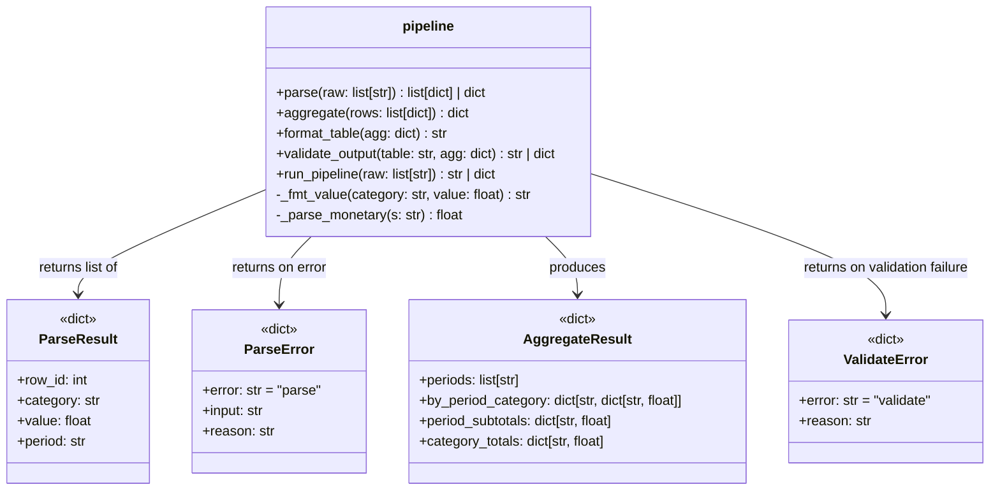

**Coverage**: 99% (34 tests, all passing)

---

## 1. Summary of What Was Created

### Solution Architecture

### Solution Description

The solution implements a four-stage Python pipeline in a single module (`report_pipeline/pipeline.py`):

1. **Parse** (`parse()`): Validates and structures raw colon-delimited string records. Returns a list of dicts with `{row_id, category, value, period}` or an error dict on validation failure. Handles: wrong field count, invalid row_id (≤0), unknown categories, non-numeric values, negative values for non-COST categories, and invalid period formats (YYYY-QN only).

2. **Aggregate** (`aggregate()`): Groups parsed rows by period × category, sums values per group, computes per-period subtotals and per-category grand totals. Periods are sorted chronologically.

3. **Format** (`format_table()`): Renders a right-aligned plain-text table from aggregated data. HEADCOUNT as plain integers, REVENUE/COST with `$`/`-$` prefix and comma thousands separators. Columns are auto-sized with ≥2 spaces padding.

4. **Validate** (`validate_output()`): Checks the formatted table for period presence in header, TOTAL column existence, and per-row TOTAL accuracy.

5. **Full Pipeline** (`run_pipeline()`): Composes all four stages, short-circuiting on any error.

---

## 3. Test Quality Analysis

### Are the tests and assertions meaningful?

**Mostly yes.** The core tests (`test_parse_single_revenue_row`, `test_aggregate_sums_same_period_category`, `test_aggregate_periods_sorted_chronologically`, `test_format_table_revenue_has_dollar_prefix`, etc.) directly assert the business-relevant behavior. Error condition tests (`test_parse_negative_revenue_is_error`, `test_parse_invalid_category`, etc.) correctly verify structured error returns.

The last batch of coverage-driven tests (`test_validate_output_invalid_value_string_skips_row`, `test_validate_output_non_parseable_cell_skips_row`, `test_validate_output_cells_with_non_numeric_values_skipped`) are weaker — two of them essentially repeat each other (testing that validation doesn't crash on non-parseable data) and they test a graceful-skip behavior that may reflect an implementation choice more than a spec requirement.

### Are the tests well readable and expressively named?

**Yes, generally.** Names like `test_parse_negative_revenue_is_error`, `test_aggregate_periods_sorted_chronologically`, `test_format_table_headcount_as_plain_integer` are clear and descriptive. The test-file structure uses section headers (`# ── Stage 1: Parse ───`), which aids readability.

Minor concern: `test_validate_output_invalid_value_string_skips_row` has a misleading comment about HEADCOUNT and the test body doesn't actually send an invalid string — it just validates a valid table a second time. It is essentially a duplicate of `test_validate_output_valid_table_returns_string`.

### Do the tests act like good clients or do they know too much about internals?

**Mixed.** 

Good: The parse and aggregate tests work through the public API (`parse()`, `aggregate()`), asserting on returned dict structures without assuming implementation details.

Concern: The aggregate tests directly assert on internal dict keys like `by_period_category`, `period_subtotals`, and `category_totals`. This couples tests tightly to the aggregate output format. If the output representation changed (e.g., using a dataclass), all aggregate tests would break.

The `_make_agg()` helper is an excellent pattern — it pipelines real parse + aggregate calls, avoiding mocks and ensuring tests work against realistic data.

### Test data quality

**Good.** Test data is realistic (reasonable dollar amounts, valid quarter strings, plausible headcounts). Multi-period tests (`test_aggregate_periods_sorted_chronologically`, `test_run_pipeline_multiple_periods`) use meaningful combinations. The large-number test (`test_format_table_thousands_separator` using `$1,234,567.89`) correctly probes formatting.

One gap: No test exercises a valid COST row with zero (boundary between positive and negative), and there's no test for a period like `2024-Q4` (edge quarter value).

### Mock usage

**None.** No mocks are used. Integration-style tests compose real pipeline stages, which is appropriate and desirable for this problem.

### Other observations

- **`test_validate_output_column_width_at_least_header_width`** has a descriptive docstring promising "no column narrower than its header" but the assertion is simply `assert isinstance(result, str)` — it doesn't actually verify column widths. The test name and docstring are misleading. It just re-checks that validation passes, which is already tested by `test_validate_output_valid_table_returns_string`.
- The `test_validate_output_total_mismatch_returns_error` test is good — it uses real data, surgically corrupts one cell, and verifies the mismatch message.
- 34 tests for 133 implementation lines (approximately 4 tests per 16 lines) is a healthy ratio.
- Three tests at the end (`test_validate_output_empty_lines_skipped`, `test_validate_output_non_parseable_cell_skips_row`, `test_validate_output_cells_with_non_numeric_values_skipped`) are defensive/regression-style tests targeting guard code paths rather than spec behavior. They improve coverage but add noise.

---

