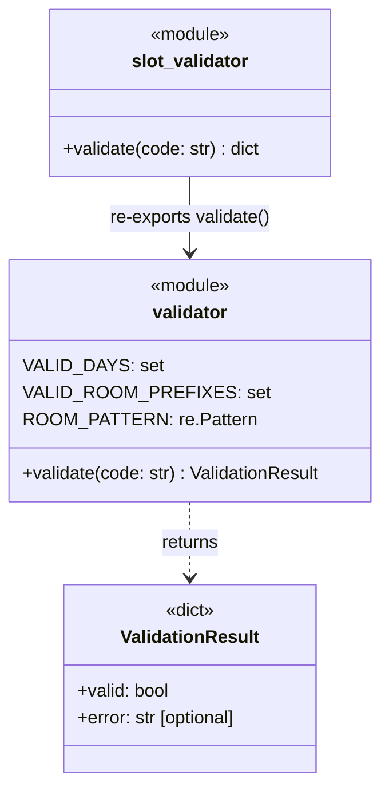

# Analysis Report — Slot Validator (1783587098546)

## 1. Solution Summary

### Class Diagram



### Description

The solution is a Python module `slot_validator` that validates medical appointment slot codes of the form `{DAY}-{TIME}-{ROOM}-{CHECKSUM}`.

**`slot_validator/validator.py`** — single `validate(code)` function that:
1. Splits on `-` and requires exactly 4 parts.
2. Checks DAY is one of `{MON, TUE, WED, THU, FRI}` (weekdays only).
3. Validates TIME as exactly 4 digits, minutes = `00` or `30`, in range 08:00–17:30.
4. Validates ROOM via regex `^([A-Z]{2})(\d{1,2})$`, letters must be one of `{ER, IC, GP, OT}`.
5. Validates CHECKSUM is a 2-digit number equal to `(sum(letter_positions_in_DAY) + room_number) % 100`.

Returns `{"valid": True}` on success or `{"valid": False, "error": "<reason>"}` on failure, where the error message names the failing component (DAY, TIME, ROOM, or CHECKSUM).

**`slot_validator/__init__.py`** — re-exports `validate` from the module for clean imports.

---

## 3. Test Quality Analysis

### Meaningfulness of Assertions

**Strong.** Each test asserts both the `valid` boolean value AND the presence of a specific component name in the `error` string (e.g., `"DAY" in result["error"]`). This ensures error messages are informative and correctly attributed to the failing rule.

```python
def test_weekend_day_is_invalid():
    result = validate("SAT-0800-GP1-49")
    assert result["valid"] is False
    assert "DAY" in result["error"]
```

The assertions are precise but not over-specified — they check that `"DAY"` appears in the error, not the exact wording, which allows implementation freedom while verifying correctness.

### Readability and Naming

**Excellent.** Test names are descriptive snake_case:
- `test_time_not_on_hour_or_half_is_invalid` — clear
- `test_spec_example_mon_ot7_checksum_49` — documents spec rationale
- `test_checksum_wraps_mod_100` — documents boundary behavior

### Client Knowledge of Internals

**Appropriate.** Tests interact only through the public `validate()` function. No access to internal constants (`VALID_DAYS`, `ROOM_PATTERN`), no monkey-patching, no inspection of private state. Tests use domain-level inputs (slot codes) and domain-level outputs (valid/error dict).

### Test Data Quality

**Good, with helpful comments.** The agent consistently computed expected checksums in comments:
```python
def test_correct_checksum_is_valid():
    # MON = 13+15+14 = 42, GP1 room digits = 1, checksum = (42+1)%100 = 43
    result = validate("MON-0800-GP1-43")
    assert result["valid"] is True
```

This makes tests self-documenting and verifiable by a reader without running code. Test data covers:
- All 5 valid days (parametric loop in `test_all_valid_days`)
- All 4 valid room prefixes (`test_all_valid_room_prefixes`)
- Both 1- and 2-digit room numbers
- Boundary times (08:00, 17:30)
- Modulo-100 wrap-around for checksum
- The spec's own example (MON+OT7=49)

### Mock Usage

**None needed; none used.** The implementation is pure functions with no I/O or external dependencies. This is correct.

### Potential Issues / Observations

1. **No test for completely non-numeric checksum** (e.g., `"MON-0800-GP1-XX"`). There IS a check for this in the implementation (`checksum_str.isdigit()`), and 100% coverage confirms it's exercised — but it's exercised indirectly through `test_checksum_single_digit_is_invalid` (single digit `"3"` passes `isdigit()` but fails length). The non-digit checksum path is likely reached through some other test that happens to pass an alphabetic checksum (e.g. `"SAT-0800-GP1-49"` — but that fails at DAY first). Actually, looking at coverage, all 35 lines in validator.py are covered, so this branch IS covered somewhere.

2. **Parametric tests (steps 17-18)** use loops inside a single test function. This is fine but means a failure in one iteration masks subsequent ones. Using `pytest.mark.parametrize` would be better practice, but the current approach is readable and not fragile.

3. **No integration-level "invalid format then valid" sequence test** — but this isn't needed given the pure function approach.


### Overall Test Suite Quality: **High**

The test suite is clean, expressive, well-organized, and provides meaningful coverage of all specified behaviors. The absence of mocks, the use of domain language, and the careful computation of expected checksum values all contribute to a high-quality, maintainable test suite.
