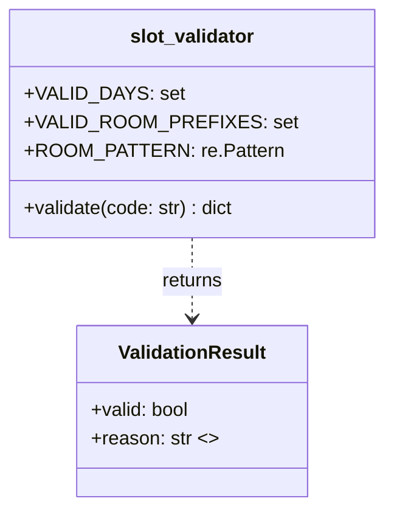

# Solution Summary — Slot Validator (Run 1783590349381)

## 1. What Was Created

A Python module `slot_validator` that validates appointment slot codes for a medical scheduling system.

### Class Diagram



The module is intentionally simple: a single `validate(code)` function that returns a structured dict with:
- `{"valid": True}` for valid codes
- `{"valid": False, "reason": "<specific failure message>"}` for invalid codes

### Validation Rules (in order of application)

1. **Format** — exactly 4 dash-separated segments
2. **DAY** — must be MON, TUE, WED, THU, or FRI
3. **TIME format** — must be exactly 4 digits (HHMM)
4. **TIME minutes** — must be 00 or 30 (on the hour or half-hour)
5. **TIME range** — between 08:00 and 17:30 inclusive
6. **ROOM format** — must match `(ER|IC|GP|OT)\d{1,2}`
7. **CHECKSUM format** — must be exactly 2 digits
8. **CHECKSUM value** — `(sum of DAY letter positions + room digits) % 100`

### Final Test Results

- **21 tests**, all passing
- **100% line and branch coverage** (`slot_validator/__init__.py`: 30 stmts, 0 missing)

---

## 3. Test Quality Analysis

### Strengths

**Meaningful assertions:**  
Most tests check both `valid == False` and `"reason"` content. This verifies the structured result contract properly. E.g.:
```python
def test_invalid_day_abbreviation():
    result = validate("SAT-0800-GP1-55")
    assert result["valid"] is False
    assert "day" in result["reason"].lower()
```
This is a good client: it verifies the behavior from the outside without caring about internals.

**Expressive names:**  
Test names like `test_boundary_time_0800_is_valid`, `test_checksum_wraps_modulo_100`, and `test_time_must_be_on_hour_or_half_hour` are clear and specific. They read like specifications.

**Realistic test data:**  
The agent carefully computed correct checksum values for each test code and verified them (it even ran a Python one-liner to check: `python3 -c "day='MON'; print(sum(ord(c)-ord('A')+1 for c in day)); print((42+1)%100)"`). Test data reflects the actual spec example (`MON-0900-OT7-49`).

**Good boundary coverage:**  
Tests 12–15 cover all four edges of the time range (08:00 valid, 17:30 valid, 07:30 invalid, 18:00 invalid). Tests 16–18 cover each valid day and a 2-digit room suffix. Test 18 covers checksum modulo wraparound.

**No mocks** — there's nothing to mock here; all tests use the actual module directly.

### Minor Issues

**Test 1 uses an invalid code:**  
`test_returns_structured_result` calls `validate("MON-0800-GP1-55")` — checksum 55 is incorrect (correct is 43). The test only checks that a dict with a `"valid"` key is returned, so it still passes. But this is mildly confusing: the test comment says nothing about the code being purposely invalid. A neutral or valid code would be cleaner here (or an explicit comment noting only the structure is being checked, not the validity outcome).

**Test numbering is non-sequential in file:**  
Tests 5 and 6 are numbered out of order in the file (test 6 appears before test 5 in the final file). This is cosmetic but slightly confusing when reading. Order in file: 1, 2, 3, 4, 6, 5, 7, 9, 10, 11, 8, 12–18. This appears to be a side effect of the incremental editing style.

**Reason string checking is somewhat broad:**  
Tests check `"time" in result["reason"].lower()` rather than checking for the exact reason string. This is appropriate — it verifies the user-facing message category without being brittle about exact wording. However, it means that a future refactoring could produce a reason string that mentions "time" but is incorrect in other ways without failing. This is an acceptable trade-off.

**No test for SUN/holiday weekend abbreviation with correct structure:**  
The test for invalid DAY uses `SAT`. No test checks `SUN`. While this is a minor gap (one invalid day is sufficient to test the rule), it could be argued that all invalid day edge cases deserve a test.

### Overall Test Quality: Good

The tests are well-written, appropriately scoped. They function as good clients: they specify expected external behavior without peeking at internals. The test data is accurate and meaningful. The suite is not over-engineered (no parametrize hell, no excessive setup). The 100% coverage is a result of thorough spec coverage rather than test-padding.
