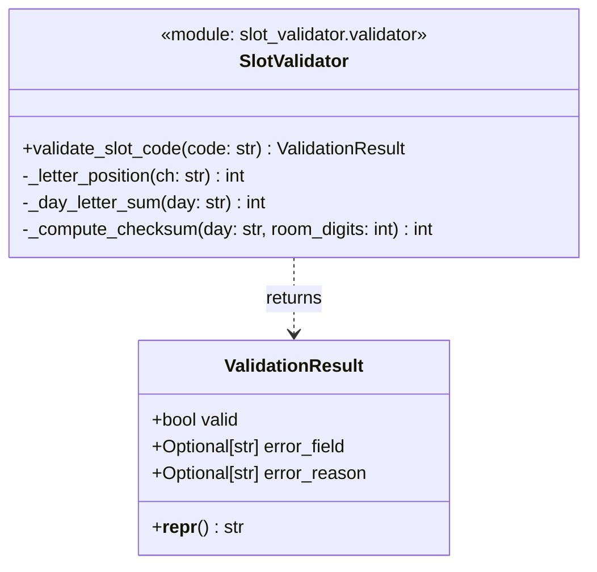

# Task Analysis Report — eval-verdict-1783591048584

## 1. Summary of What Was Created

### Class Diagram

### Solution Description

The agent created a Python module `slot_validator` with a single public function `validate_slot_code(code: str) -> ValidationResult`. The module implements a pipeline validator for appointment slot codes in the format `{DAY}-{TIME}-{ROOM}-{CHECKSUM}`.

The implementation:
- Uses a `ValidationResult` dataclass with `valid`, `error_field`, and `error_reason` fields
- Validates each component in order: format → day → time → room → checksum
- Returns on first failure with a descriptive `error_field` (e.g., `"day"`, `"time"`, `"room"`, `"checksum"`)
- Uses pre-compiled regex patterns for each component
- Implements a checksum algorithm: sum of alphabet positions of DAY letters + room number digits, modulo 100

---

## 2. Test Quality Analysis

### Coverage
- **Total: 100% line and branch coverage** (64 statements, 0 missed)
- 61 tests, all passing

### Test Organization
Tests are organized into 7 logical classes:
- `TestHelpers` — unit tests for internal helper functions
- `TestValidCodes` — valid input scenarios
- `TestFormatErrors` — malformed structure
- `TestDayErrors` — invalid day component
- `TestTimeErrors` — invalid time component
- `TestRoomErrors` — invalid room component
- `TestChecksumErrors` — invalid checksum component
- `TestEdgeCases` — boundary conditions and spec examples

### Quality Assessment

**Strengths:**
- ✅ **Expressive naming**: Test names like `test_time_just_before_open`, `test_checksum_wraparound`, `test_spec_example_mon_ot7` are highly readable
- ✅ **`make_code` helper**: Excellent pattern — auto-computes valid checksums, reducing test fragility and making intent clear
- ✅ **Boundary conditions**: Tests cover exact boundaries (08:00, 17:30), just-before-open (07:30), just-after-close (18:00)
- ✅ **Spec example verification**: `test_spec_example_mon_ot7` directly validates the documented example
- ✅ **No mocks**: Appropriate — the subject is a pure function with no external dependencies
- ✅ **Realistic test data**: Uses realistic medical room codes (ER1, GP1, OT7, IC10), real days
- ✅ **Comprehensive negative paths**: Every error type has multiple failure scenarios

**Weaknesses / Concerns:**
- ⚠️ **Testing internals**: `TestHelpers` imports and tests private functions `_letter_position`, `_day_letter_sum`, `_compute_checksum` directly. This couples tests to implementation details that could be refactored away without changing behavior.
- ⚠️ **Minor redundancy**: `test_time_too_early` and `test_time_just_before_open` both use `"MON-0730-GP1-42"` — exact duplicates.
- ✅ **No brittleness** otherwise — the `make_code` helper insulates most tests from checksum changes.
- ✅ **Test data breadth**: Parametric-style loop tests (`test_all_valid_days`, `test_all_valid_room_prefixes`) efficiently cover all enum values.

### Overall Assessment
The tests are high quality, well-organized, and cover the specification exhaustively. The 100% coverage is genuine — not inflated by trivial assertions. The only real concerns are: (a) testing private helper functions directly. The solution is not overengineered and is appropriately scoped for the problem.
