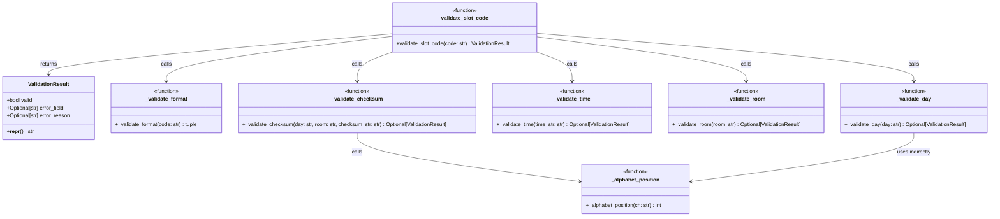

# Evaluation Report: Medical Scheduling Slot Code Validator

## 1. Summary of the Solution

### Class Diagram



### Description

The solution implements a single-function validator for appointment slot codes in a medical scheduling system. The slot format is `{DAY}-{TIME}-{ROOM}-{CHECKSUM}`.

- **`ValidationResult`** (dataclass): Structured return type with `.valid`, `.error_field`, and `.error_reason` fields, plus a custom `__repr__`.
- **`validate_slot_code(code)`**: Main entry point, orchestrates all validation steps in order (format, DAY, TIME, ROOM, CHECKSUM), returning on the first failure found.
- **Private helper functions**: Each validation concern is encapsulated in a dedicated `_validate_*` function. The checksum is computed as `(sum_of_day_letter_positions + room_number_digits) % 100`.
- **Constants**: `VALID_DAYS = {"MON","TUE","WED","THU","FRI"}`, `VALID_ROOM_PREFIXES = {"ER","IC","GP","OT"}`, time range 08:00–17:30.

---

## 2. Testing Approach

Final result: **58 tests passed, 100% coverage**.

---

## 3. Test Quality Analysis

### Are the tests and assertions meaningful?

**Yes, highly so.** Tests are logically organized by concern (format, day, time, room, checksum, integration) and check not just `result.valid` but also `error_field` and `error_reason` contents. For example:

```python
def test_wrong_checksum(self):
    r = validate_slot_code("MON-0900-GP1-00")
    assert r.valid is False
    assert r.error_field == "CHECKSUM"
    assert "43" in r.error_reason  # verifies expected value in message
```

### Are the tests well readable and expressively named?

**Yes.** Method names like `test_checksum_wraps_modulo_100`, `test_time_not_on_hour_or_half`, `test_day_with_digits` clearly communicate intent. Classes group related tests (`TestDayValidation`, `TestRoomValidation`, etc.).

### Do the tests behave like good clients?

**Largely yes.** Tests interact through the public API (`validate_slot_code`) and check observable outputs. The helper `checksum_for()` duplicates the checksum algorithm in the test file — this is a slight concern (test mirrors implementation), but it's reasonable and predictable for a checksum function.

### Test data coverage

**Very thorough.** The tests include:
- All 5 valid days
- All 4 valid room prefixes
- Boundary times (0800, 1730) and off-boundary ones (0730, 1800, 0915)
- On-the-hour and half-hour increments across the range
- Checksum wraparound (modulo 100)
- 1-digit vs 2-digit room numbers
- Integration tests with manually computed expected checksums

### Mock usage

**None used** — appropriate for a pure-function validator that has no I/O or external dependencies.

### Any issues?

- **Duplicate test**: `test_time_after_1730` and `test_time_at_1730_plus_30` both test `make_code(time="1800")` — these are identical and one is redundant.
- **Test `make_code` helper assumes checksum is None for invalid-room cases**: The comment in `test_room_no_digits` notes this, but it bypasses the helper in a clean way (`"MON-0900-GP-43"`).
- **Test `test_validation_result_fields_on_failure`** uses `"BAD-CODE-HERE-NOW"` which is a valid 4-part format but invalid DAY — it works fine, but the test name suggests it could hit any validation path unpredictably as the code evolves.
- **Overall**: The test suite is well-structured, comprehensive, and not over-engineered. There is no mocking fragility, no excessive parameterization, and no obscure test data.

### Final Test Coverage

| Module | Statements | Missed | Coverage |
|--------|-----------|--------|----------|
| `slot_validator/__init__.py` | 1 | 0 | 100% |
| `slot_validator/validator.py` | 78 | 0 | 100% |
| **TOTAL** | **79** | **0** | **100%** |
