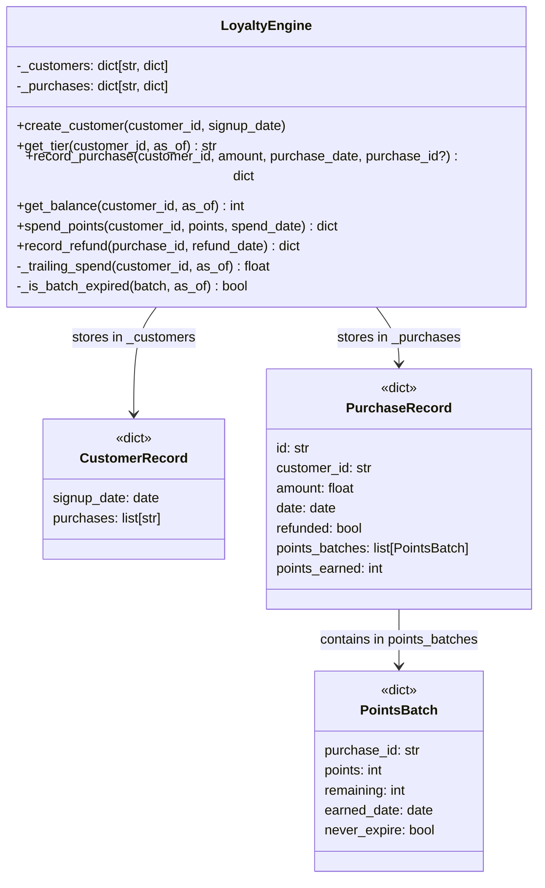

# Report — Loyalty Points Engine

---

## 1. Summary of What Was Created

A Python in-memory loyalty points engine exposed as a single `LoyaltyEngine` class.



### Module-level constants:
- `TIER_RATES = {"Bronze": 1.0, "Silver": 1.25, "Gold": 1.5}`
- `_compute_tier(trailing_spend)` — pure function for tier determination

### Domain rules implemented:
1. **Earning points** — tier-based rates (1x / 1.25x / 1.5x), floored to whole points via `math.floor`
2. **Tiers** — trailing 365-day spend (excluding refunded purchases), recalculated on every purchase; tier upgrades apply to the triggering purchase itself
3. **Expiration** — rolling 90-day window; signup-month purchases marked `never_expire=True`
4. **Refunds** — claws back only unspent points from the specific purchase; marks purchase as refunded; double-refund raises `ValueError`
5. **Spending** — oldest-batch-first, skips expired batches, rejects if insufficient balance
6. All 6 required query types supported

---

## 2. Test Quality Analysis

### Test Suite Overview
- **21 tests**, all passing, **99% line coverage** (1 uncovered line: a defensive break inside `spend_points`)
- Tests live in a single `test_loyalty.py` file in the `tests/` directory

### Meaningfulness of assertions
✅ **Strong**. Every test asserts specific numerical outcomes or state transitions:
- `assert result["points_earned"] == 125` (Silver rate confirmed exactly)
- `assert result["points_earned"] == 12` (floor of 12.5 confirmed)
- `assert p1_batch["remaining"] == 0` and `p2_batch["remaining"] == 200` (FIFO drain verified)
- `pytest.raises(ValueError)` for the double-refund guard

There are no vague or vacuous assertions (`assert result is not None`, etc.).

### Test naming and readability
✅ **Excellent**. Names are descriptive and read like specifications:
- `test_tier_upgrade_applies_to_triggering_purchase`
- `test_signup_month_points_never_expire`
- `test_spend_points_skips_expired_batches`
- `test_refund_only_claws_back_unspent_points`

Several tests include a docstring explaining the edge case, e.g.:
```python
def test_points_rounded_down():
    """Silver rate: $10 * 1.25 = 12.5 -> floor = 12"""
```

Each test uses a distinct customer name (`alice`, `bob`, `carol`, … `tia`), making failures easy to trace.

### Tests as clients of the subject under test
⚠️ **Mostly good, minor white-box access**. The majority of tests only use the public API. However, a few tests access internal state directly:
```python
p1_batch = engine._purchases["p1"]["points_batches"][0]
assert p1_batch["remaining"] == 0
```
This occurs in `test_spend_points_oldest_batch_first`, `test_spend_points_skips_expired_batches`, and `test_spend_points_across_multiple_batches_stops_at_zero`. While this makes the intent very clear, it couples the tests to the internal dict structure. An alternative would be to check the balance after targeted spends. This is a minor concern — the tests are still very useful and readable.

### Test data quality
✅ **Good**. Tests use:
- Concrete, realistic dollar amounts ($100, $1000, $5000)
- Meaningful dates that space out naturally (different months, year spans)
- Distinct purchase IDs (`"p1"`, `"p2"`, `"p3"`) to enable targeted verification
- Boundary values (90-day exact boundary tested in `test_points_still_valid_at_90_days`; 365-day cutoff in `test_trailing_spend_excludes_purchases_older_than_365_days`)

### Mock usage
✅ **None needed, none used**. The library is pure in-memory with explicit date injection, so real dates are used throughout — this is correct and preferred.

### Potential concerns
- **Internal state inspection**: As noted above, three tests inspect `engine._purchases[...]["points_batches"][0]["remaining"]`. This is the main brittleness risk.
- **No negative amount / invalid input tests**: The spec doesn't define error behavior for bad input (negative amounts, unknown customer IDs), so their absence is acceptable.
- **Date arithmetic imported inline**: Some tests do `from datetime import timedelta` inside the function body rather than at the top — minor style inconsistency but not a problem.
- **Overall**: The suite is not overengineered or brittle. It covers all spec behaviors with focused, realistic tests.

---

## Verdict Summary
- ✅ All spec behaviors implemented and tested
- ✅ 99% coverage (well above 80% threshold)
- ✅ High-quality, expressive, realistic tests
- ⚠️ Three tests access internal `_purchases` dict (minor brittleness)
