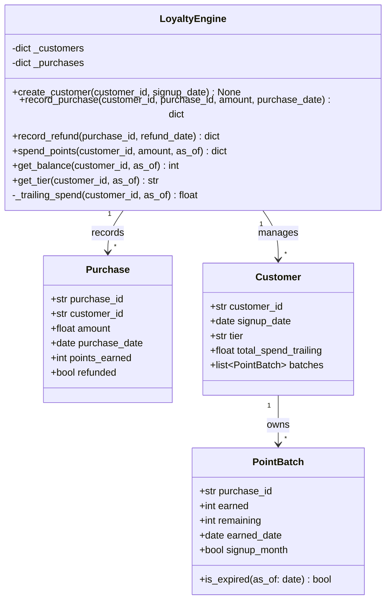

# Analysis Report — Loyalty Points Engine (1783603068879)

## 1. Summary of What Was Created

### Class Diagram



### Solution Description

The agent created a complete in-memory loyalty points engine in Python, structured as a single module `loyalty_engine/engine.py` with a clean public API class `LoyaltyEngine`.

**Domain model:**
- `PointBatch`: Represents a batch of points earned from a single purchase, tracking original amount, remaining balance, earned date, and whether it was earned during the signup month (preventing expiry). The `is_expired()` method implements the 90-day rolling window rule.
- `Purchase`: Records purchase metadata including refund state.
- `Customer`: Aggregates customer state — signup date, current tier, and list of point batches.
- `LoyaltyEngine`: The main facade. All six required query operations are implemented.

**Key design decisions:**
- Tier recalculation is on-demand using a `_trailing_spend()` helper that looks at all non-refunded purchases within the past 365 days.
- The expiry logic is per-batch, with a special `signup_month` flag to permanently exempt those points.
- Spending uses a sorted oldest-first traversal, skipping expired batches.
- Refund claws back only the remaining points from the specific batch, preventing negative balances.
- A module-level `_tier_for_spend()` helper encapsulates the tier ladder logic.

**Final state:** 22 tests, all passing, 99% line coverage (only one unreachable line: the final `return "Bronze"` fallback in `_tier_for_spend`, which is dead code since `(0, "Bronze")` always matches).

---

## 3. Final Test Suite Quality

### Are tests and assertions meaningful?
**Yes.** All 22 tests assert on specific values (exact point counts, tier names, boolean success flags, balance amounts). There are no vague truthy checks in the final suite. Each test exercises a distinct spec behavior.

### Are tests well readable and expressively named?
**Yes.** Tests are named descriptively and each has a comment header like:
```
# ── Test 7: Points expire after 90 days ─────
def test_points_expire_after_90_days():
```
The intent is immediately clear without reading the implementation.

### Do tests behave like good clients, or do they know too much about internals?
**Mostly yes, with one exception.** Test 12 (`test_spend_consumes_oldest_first`) directly accesses `engine._customers["c1"]` to inspect batch state:
```python
customer = engine._customers["c1"]
batches_by_date = sorted(customer.batches, key=lambda b: b.earned_date)
assert batches_by_date[0].remaining == 0
assert batches_by_date[1].remaining == 150
```
This is a **white-box test** that couples directly to internal implementation (private `_customers` dict, `PointBatch.remaining` field). If the internal representation changes, this test breaks even if the externally-observable behavior is correct. All other tests only use the public API.

### Test data coverage
**Good.** The test data is:
- Realistic dollar amounts ($100, $900, $1000, $4900, $5000, $200)
- Carefully chosen dates to hit boundaries (e.g., exactly 90 days, 91 days, 364 days, 366 days in trailing window)
- Boundary cases are explicitly covered: 90-day expiry boundary (tests 7 & 8), 365-day tier window boundary (tests 18 & 19), signup-month non-expiry (tests 9 & 21), partial spend before refund (test 15)

### Mocks
No mocks are used. Tests are pure integration tests of the in-memory engine. This is appropriate since the spec explicitly states it's an in-memory library — no I/O or external dependencies to mock.

### Overengineered / Underengineered / Brittle?
- **No over-engineering:** Tests are simple and direct.
- **No under-engineering:** 22 tests cover all 6 query types and all major domain rules.
- **One brittleness concern:** The one white-box test (`test_spend_consumes_oldest_first`) is fragile with respect to implementation refactoring.
- **Minor gap:** The spec's "purchase can only be refunded once" behavior is tested for `ValueError`, but there's no test verifying that a refunded purchase correctly reduces the tier's trailing spend (though test 17 covers tier downgrade after refund in a related scenario).

### Overall Assessment
The final test suite is **high quality** — expressive, realistic, comprehensive, and mostly treating the engine as a black box. All spec behaviors are implemented, all tests pass, and coverage is 99%.

---

## Summary

| Criterion | Result |
|-----------|--------|
| All spec behaviors implemented | ✅ Yes |
| Tests pass | ✅ 22/22 |
| Coverage ≥ 80% | ✅ 99% |
| Test quality | ✅ High (1 minor white-box coupling) |
