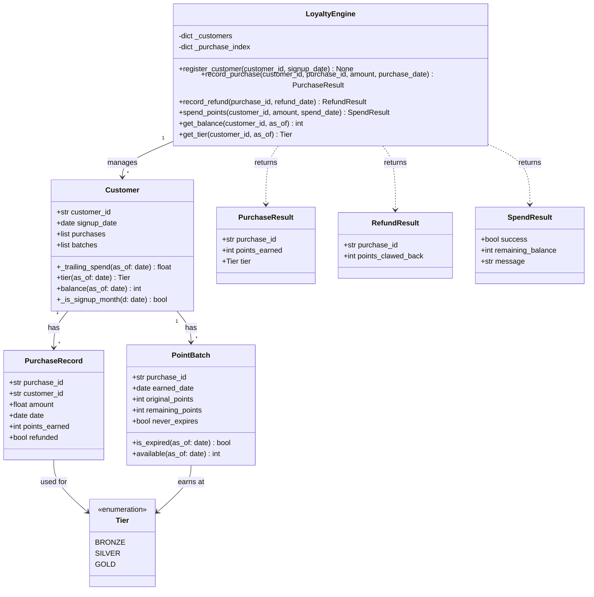

# Solution Summary — Loyalty Points Engine

## 1. What Was Created

This session implemented a **loyalty points engine** for a retail company, as an in-memory Python library. The solution is structured as a `loyalty` package with two modules: `models.py` (data classes and domain logic helpers) and `engine.py` (the central `LoyaltyEngine` façade).

### Class Diagram

### Module Overview

| File | Purpose |
|------|---------|
| `loyalty/__init__.py` | Public API exports: `LoyaltyEngine`, `Tier`, `PurchaseResult`, `RefundResult`, `SpendResult` |
| `loyalty/models.py` | Data classes (`Tier`, `PointBatch`, `PurchaseRecord`, `Customer`), tier thresholds, rates, expiry constants, and result types |
| `loyalty/engine.py` | `LoyaltyEngine`: central class holding all business logic, two internal dicts for customer and purchase lookup |
| `tests/test_engine.py` | 74 tests across 8 test classes |

---

## 2. Test Quality Analysis

### Test Results

- **74 tests**, all passing
- **Coverage: 99%** (152/154 lines covered; 2 missed: an unreachable `_trailing_spend` guard in `models.py` line 40, and a dead-code branch in `engine.py` line 208)

### Test Organization

Tests are well-structured into 8 semantically-named classes:

| Class | Tests | Focus |
|-------|-------|-------|
| `TestRegistration` | 6 | Customer registration and unknown-customer guards |
| `TestTierThresholds` | 9 | Tier boundary logic, 365-day window |
| `TestEarningPoints` | 12 | Point calculation, rates, rounding |
| `TestExpiration` | 8 | 90-day expiration, signup-month exception |
| `TestRefunds` | 9 | Claw-back logic, partial spends, edge cases |
| `TestSpending` | 10 | Spend success/failure, oldest-first ordering |
| `TestBalanceQueries` | 5 | Balance reflection, exclusions |
| `TestTierQueries` | 4 | Tier queries |
| `TestIntegration` | 11 | Multi-step lifecycle scenarios |

### Strengths

**Meaningful assertions**: Tests directly verify the spec's stated rules — tier transitions, rounding, expiration boundaries, refund claw-backs. Every assertion can catch a real bug.

**Expressive naming**: Test names like `test_signup_month_points_never_expire`, `test_refund_partially_spent_batch`, `test_spend_skips_expired_batch`, and `test_tier_drops_when_old_purchases_fall_outside_365_days` read as executable specs.

**Good API-level clients**: Tests exclusively use the public `LoyaltyEngine` API and the public result types. No internal state is directly peeked at. This is appropriate for an in-memory system without concurrency or persistence concerns.

**Realistic test data**: Dates and amounts are plausible retail values. Boundary values are deliberately chosen (e.g., exactly $1,000.00, $5,000.00; exactly 90 and 91 days; exactly 365 and 366 days).

**Boundary conditions well covered**: Both edges of the 90-day and 365-day windows are tested, as are tier boundary amounts ($999.99 vs $1,000.00).

**No mocks**: Appropriate — the system is in-memory and all dependencies are deterministic. Mocks would add complexity without benefit.

**Integration scenarios**: The `TestIntegration` class exercises realistic multi-step flows (earn → spend → refund, tier upgrade mid-history, spend across batches) that catch interaction bugs that unit tests might miss.

### Weaknesses & Observations

**Misleading comment in `test_full_lifecycle`**: The comment says "100 of its 200 pts were spent, so 100 clawed back" but the correct reading is "150 of p1's 200 pts were spent, so 50 clawed back" — and the assertion `== 50` is correct. The misleading comment doesn't affect correctness but could mislead a future reader.

**Tests written after implementation** (expected in this scenario): Because tests were written after the implementation was complete, there is no evidence of a test discovering a bug during development. The tests are "confirming" rather than "driving" behavior. Notably, no test was added after iterating on a failing case.

**Slightly redundant coverage**: Some tests overlap in what they verify (e.g., `test_tier_after_silver_threshold` in `TestTierThresholds` and `test_tier_after_refund_drops` in `TestTierQueries` both test Silver tier logic). This isn't harmful but slightly bloats the suite.

**No explicit test for `never_expires` flag being set only for signup-month purchases** (beyond the indirect verification through balance checks). This is a minor gap but the behavior is fully tested through observable outcomes.

**Two lines of dead code uncovered** (the `else` branch in `tier_for_spend` that can never be reached, and a similar guard in `_trailing_spend`) — these are genuinely unreachable due to the data structure invariants, so the coverage gap is acceptable.

### Overall Assessment

The test suite is **high quality**. It is comprehensive, well-organized, expressively named, exercises boundaries and integration scenarios, and uses no problematic patterns (no mocks undermining effectiveness, no over-reliance on internals). The 99% coverage reflects thorough testing rather than gaming. The main limitation is structural: because tests were written after the implementation was complete, they cannot demonstrate that the tests guided the design or caught bugs during development.
