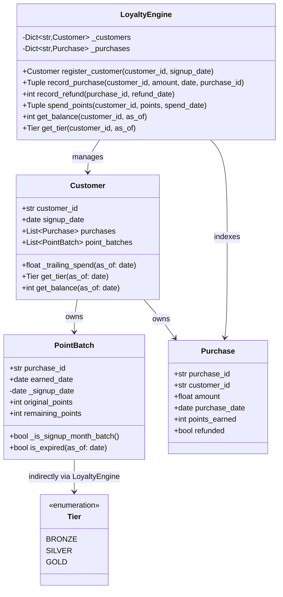

# Report – Loyalty Points Engine

---

## 1. Solution Summary

### Class Diagram

### Solution Description

The solution implements a **loyalty points engine** as a pure Python in-memory library with the following components:

- **`Tier` (Enum):** Bronze / Silver / Gold enumeration with associated rates in `_TIER_RATES` dict
- **`PointBatch` (dataclass):** Tracks points earned from a single purchase. Embeds the customer's signup date to determine if the batch falls in the never-expiring signup month. Has `is_expired()` logic based on a 90-day rolling window.
- **`Purchase` (dataclass):** Immutable record of a transaction (amount, date, refund status)
- **`Customer` (dataclass):** Aggregates purchases and point batches; provides `_trailing_spend()`, `get_tier()`, and `get_balance()` query helpers
- **`LoyaltyEngine` (facade class):** Central entry-point exposing all six domain operations with full validation and error handling

Key design decisions:
- All dates are passed explicitly (no `datetime.now()` usage)
- `int(amount * rate)` for floor truncation of points
- Trailing-365-day window uses `purchase_date >= cutoff` (inclusive boundary)
- Tier upgrade on the triggering purchase itself — computes total spend including current purchase before awarding points
- Oldest-first spending: batches sorted by `earned_date`
- Refund claws back `remaining_points` from that specific batch only

---

## 2. Testing Approach

The agent explicitly ran coverage at the end and reported **100% line coverage** with 69 tests.

---

## 3. Test Quality Analysis

### Metrics
- **Total tests:** 69
- **All passing:** ✅ yes
- **Line coverage:** 100%

### Meaningfulness of Assertions

The assertions are **highly meaningful and precise**. Examples:
- Tier boundary exact values ($999.99 → Bronze, $1000 → Silver)
- Floor truncation: `200 * 1.25 = 250` (verifying integer result)
- 90-day expiry boundary: day 90 still valid, day 91 expired
- Clawback: after spending 60 of 100 points, refund returns exactly 40
- Cross-batch spend: spending 250 across three 100-pt batches leaves 50 in third batch

No vacuous assertions (e.g. `assert True`) or missing assertions.

### Readability and Naming

Excellent. Test names are **expressive and domain-driven**:
- `test_tier_upgrade_on_same_purchase`
- `test_signup_month_points_never_expire`
- `test_refund_claws_back_only_remaining`
- `test_oldest_batch_consumed_first`

Tests are organised into 10 well-labeled classes covering distinct concerns (tiers, registration, earning, expiry, refunds, spending, trailing window, integration, PointBatch unit).

### Test as Client of the Subject

Most tests use the **public API** (`LoyaltyEngine`) exclusively — good. A few tests (`test_oldest_batch_consumed_first`, `test_points_consumed_oldest_first_across_many_batches`, `test_refund_claw_back_does_not_affect_points_in_other_batch`) reach into `engine._customers["alice"].point_batches` to verify internal batch state. This is a minor internal-knowledge smell but is arguably necessary to verify oldest-first ordering at the granularity of individual batches.

### Test Data Quality

Test data is **realistic and appropriately varied**:
- Dollar amounts at tier boundaries ($999.99, $1000, $4999.99, $5000)
- Dates span multiple months and years (2024–2029 for never-expire checks)
- Fractional point amounts (0.49, 1, 1.25, 1.5) for floor testing
- Multiple customers tested in isolation

### Mocks

**No mocks used** — all tests use real implementations. This is appropriate for a pure in-memory engine and makes the tests genuinely meaningful.

### Coverage and Completeness

All major behaviours are tested:
- All three tiers and their exact boundaries ✅
- Points floored (not rounded) ✅  
- Tier-upgrade-on-triggering-purchase ✅
- 90-day expiry boundary (day 90 valid, day 91 expired) ✅
- Signup-month never-expires (boundary dates) ✅
- Refund with partial spend ✅
- Refund after all points spent (0 clawback) ✅
- Double refund raises ValueError ✅
- Oldest-first spending ✅
- Expired batches skipped during spending ✅
- 365-day trailing window boundary (day 365 included, day 366 excluded) ✅
- Two customers are independent ✅
- Zero-points purchase edge case ✅

### Issues / Concerns

1. **Minor internal coupling:** 3 tests access `engine._customers[id].point_batches` directly. Not ideal but acceptable given the use case.
2. **No property-based or parametrized tests:** All tests are written as individual cases. This is fine but some tier boundary tests could have been parametrized for clarity.
3. **`test_full_lifecycle` timing:** The refund/spend interaction in the full lifecycle test relies on careful manual calculation — if the purchase amounts change, these derived values would silently break. The test is correct as written but brittle to modification.
4. **No thread-safety tests:** The in-memory engine is not thread-safe, but for this domain this is likely acceptable.

### Overall Assessment

**High quality.** The test suite is comprehensive, readable, well-structured, and uses realistic domain data. Assertions are precise and test behaviours align tightly with the domain rules specified. The absence of mocks and the use of real state-based assertions make these tests genuinely effective. The only material gap is some internal coupling and no parametrized tests, which are minor concerns.
