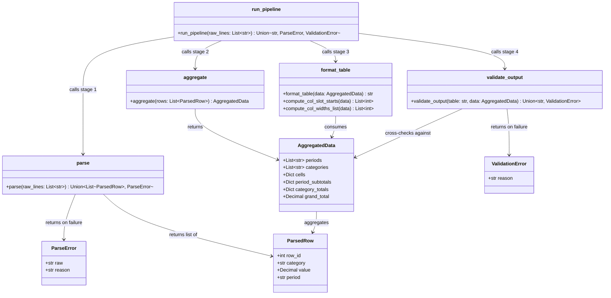

# Solution Summary

## 1. What Was Created

A Python module `report_pipeline/` that transforms raw report data through a 4-stage formatting pipeline, producing a plain-text table ready for export.

### Architecture Class Diagram

### Module Structure

| File | Purpose |
|------|---------|
| `report_pipeline/parse.py` | Stage 1 — parses `"{ROW_ID}:{CATEGORY}:{VALUE}:{PERIOD}"` strings, validates all fields, returns `List[ParsedRow]` or `ParseError` |
| `report_pipeline/aggregate.py` | Stage 2 — groups by `(PERIOD, CATEGORY)`, sums values, computes period subtotals, category totals, grand total; returns `AggregatedData` |
| `report_pipeline/format.py` | Stage 3 — renders plain-text table with right-aligned values, `$1,234.56`/`-$200.00` formatting for money, plain integers for HEADCOUNT; TOTAL row and column |
| `report_pipeline/validate.py` | Stage 4 — checks all periods in header, TOTAL column matches sum of period values, no column narrower than its header |
| `report_pipeline/pipeline.py` | `run_pipeline()` — runs all 4 stages in order, returning the table string or the first structured error |

### Testing Approach

**Final result: 75 tests passing, 100% line coverage.**

---

## 2. Test Quality Analysis

### Are the tests and assertions meaningful?
Mostly yes. Each test has a clear purpose — happy path, error case, edge case, or specific behavior. Error-case tests assert on the specific type of error and often the error message content (e.g., `assert "REVENUE" in err.reason`). However, a few are weak:
- `test_format_column_widths_at_least_header_width` ends without any actual assertion — it calculates `field` but never calls `assert`.
- `test_pipeline_empty_input` accepts `str`, `ParseError`, or `ValidationError` — essentially asserting nothing useful beyond "it doesn't crash."
- `test_validate_total_mismatch` has a conditional path that may not tamper anything: `if tampered != table: ...` — if the string replacement doesn't find a match, the test silently passes without checking anything.

### Are the tests well readable and expressively named?
Yes, generally very good. Names like `test_parse_negative_revenue`, `test_aggregate_periods_sorted_chronologically`, `test_format_table_negative_cost` clearly communicate intent. The helper functions `make_row()`, `make_table()`, and `make_table_and_data()` reduce boilerplate effectively.

### Do the tests act like good clients, or do they know too much about internals?
Mixed. Most tests interact through the public interface, which is good. However:
- `test_validate.py` directly tests private helpers `_parse_formatted_value()` and `_get_field()` — these are internal implementation details that probably shouldn't be tested directly.
- `test_validate_check3_column_too_narrow` uses `unittest.mock.patch` on `compute_col_widths_list` — this is an internal function and patching it couples the test to implementation structure.
- `test_format.py` directly imports and tests `_format_value`, a private helper.

### Do the tests use appropriate and realistic test data?
Yes. The test data is domain-realistic (REVENUE, COST, HEADCOUNT with real-world period format YYYY-QN). The numeric values are plausible, and the multi-period, multi-category scenarios mirror actual business report data.

### Are mocks used appropriately?
The one mock usage (`patch("report_pipeline.validate.compute_col_widths_list")`) is used to force a branch that is hard to trigger naturally (a column being narrower than its header). This is a borderline case — it's understandable for coverage purposes but does couple the test to the implementation. It would be better to trigger this naturally if possible, or use a property-based approach.

### Anything else fishy?
- **Missing full-output assertions in format tests**: Tests like `test_format_table_category_row_present` just check `"REVENUE" in table` rather than asserting the full formatted output. A complete snapshot assertion would be more robust and catch regressions like spacing errors or column order issues.
- **The validation stage is complex** and the tests only have a few tamper-based scenarios. The TOTAL mismatch test has a fragile conditional that could silently pass.
- **Unreachable assertion in `test_format_column_widths_at_least_header_width`**: The function computes `field` from the string but never asserts anything about it — this test adds 0 value.
- **`test_validate_skips_blank_rows`** asserts `isinstance(result, (str, ValidationError))` — this is equivalent to `assert True` and verifies nothing.

### Overall Assessment
The tests are well-organized, expressively named, and cover a wide range of scenarios. The 100% coverage is impressive, though it required some mock-based engineering. The main quality issues are: (1) a few tests with vacuous or missing assertions, (2) testing of private internal helpers (which couples tests to implementation details), and (3) snapshot-style assertions being absent from format tests (where comparing to an exact expected string would be much stronger). The test suite is solid but would benefit from tightening the weakest tests.
