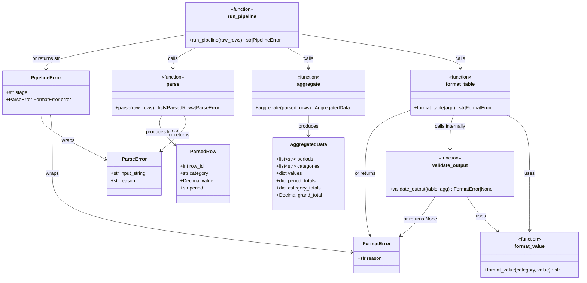

# Analysis — Report Pipeline Task

---

## 1. Solution Summary

### Class / Module Diagram

### Solution Description

The agent built a **four-stage report formatting pipeline** in Python, organized as the `report_pipeline` package:

| Module | Responsibility |
|---|---|
| `models.py` | Data classes: `ParsedRow`, `ParseError`, `AggregatedData`, `FormatError`, `PipelineError` |
| `parse.py` | Validates and parses raw `"{ROW_ID}:{CATEGORY}:{VALUE}:{PERIOD}"` strings |
| `aggregate.py` | Groups parsed rows by period × category, computes subtotals and grand totals |
| `formatting.py` | Shared value formatter: `$X,XXX.XX` for REVENUE/COST, integers for HEADCOUNT |
| `format_stage.py` | Builds the plain-text table with right-aligned, properly-sized columns |
| `validate_stage.py` | Validates the formatted table: checks period columns, TOTAL column presence and arithmetic |
| `pipeline.py` | Orchestrates all stages end-to-end via `run_pipeline()` |
| `__init__.py` | Exports all public callables from the top-level package |

The pipeline achieves **100% line and branch coverage** across 51 tests organized in 5 test files.

---

## 3. Test Quality Analysis

### Are the tests and assertions meaningful?

**Yes, strongly.** Tests verify observable, domain-meaningful behavior:
- Parse tests assert the exact field values of returned `ParsedRow` objects (row_id, category, value, period as Decimal).
- Error tests assert both the type (`ParseError`) and the specific content of the `reason` field.
- Aggregate tests verify ordering, zero-filling of missing cells, and mathematical correctness of all three totals (period, category, grand).
- Format tests check specific string representations (`"$1,234.56"`, `"-$200.00"`, plain integers) and column alignment geometry.
- Validate tests tamper with table strings to test each validation rule independently.

### Are the tests well readable and expressively named?

**Very good.** Examples:
- `test_parse_error_negative_revenue` — immediately communicates domain rule
- `test_aggregate_missing_category_filled_with_zero` — precise description of the behavior
- `test_format_periods_chronological_in_header` — what it checks and why
- `test_validate_checks_total_column_arithmetic` — clear intent

The tests are organized under comment sections (e.g., `# Happy-path parsing`, `# Error cases`, `# Layout / alignment`), which improves navigation.

### Do tests act as good clients of the SUT?

**Mostly yes.** Tests invoke public functions with realistic inputs and check public outputs. A few tests make string-level assertions (e.g., `assert "2024-Q1" in result`, `idx = header.index("2024-Q1")`) which are tightly coupled to formatting choices but still act at the "visible behavior" level rather than internal implementation.

The `test_format_values_right_aligned` test is particularly well-designed: it computes column alignment by locating the header token in the string, then checks that data cell strings end at the same character position — testing layout behavior rather than just content.

### Test data quality

**Good.** The tests use realistic domain values:
- Proper period formats (`2024-Q1`, `2023-Q4`)
- Meaningful financial numbers (`1234.56`, `1000000.00`, `-200.00`)
- Edge cases: zero row id, negative REVENUE, non-integer row ids, invalid periods (`2024-Q5`, `2024-M1`, `24-Q1`, `ABCD-Q1`)
- Multi-period and multi-category integration tests

The `test_run_pipeline_multi_period_full_integration` test is particularly strong: it uses 6 rows across 2 periods and 3 categories, and checks the computed TOTAL row grand total mathematically (`$2,322.00`).

### Are mocks used appropriately?

Two tests use `monkeypatch`:
- `test_format_table_returns_format_error_when_validation_fails` — patches `validate_output` inside `format_stage` to inject a `FormatError`. This is a reasonable use of monkeypatching to test the error propagation path of `format_table` independently from the validation logic itself.
- `test_run_pipeline_returns_pipeline_error_on_format_failure` — patches `format_table` inside `pipeline` to inject a `FormatError`. Similarly, this tests the pipeline's error-handling branch.

Both mocks are narrow in scope, test a clear boundary, and are used where integration testing would be hard to trigger naturally. They do **not** undermine the overall test suite because the real validate/format paths are well covered by other tests.

### Potential weaknesses / observations

1. **No test for uniqueness of ROW_ID** — the spec says ROW_IDs are "unique within the input," but no test verifies that duplicate ROW_IDs are rejected. The implementation also doesn't check this.

2. **TOTAL row formatting** — the spec says "TOTAL row at the bottom summing each period column" but doesn't specify the TOTAL row's number format for mixed-type columns. The implementation uses `$` formatting throughout the TOTAL row (even for HEADCOUNT-only tables). No test exercises a pure-HEADCOUNT table's TOTAL row format.

3. **Validate: column width check** — the spec requires checking "no column is narrower than its header," but `validate_output` does **not** implement this check, and there is **no test for it**. This is a spec gap.

4. **Some format tests check string fragments** (`"$1,000.00" in result`) rather than the full row structure, which could allow accidental false positives (e.g., the value appearing in the TOTAL row rather than the REVENUE row). However, in practice the specific dollar amounts are unique enough that this is unlikely to matter.

5. **No boundary tests for period** — e.g., `2024-Q0` or `9999-Q4`. The tests cover `Q5` and letter-based quarter formats but not lower bounds.

6. **No test for empty aggregate** — `aggregate([])` is not tested; the implementation may work or raise.

### Overall verdict on test quality

The test suite is **well-structured, meaningful, and genuinely behavior-driven**. Tests are readable, appropriately scoped, and use realistic domain data. The monkeypatching is applied judiciously. The main gap is the missing validation of column-width checks (a spec requirement that's neither implemented nor tested), and the missing uniqueness check for ROW_IDs. Despite these gaps, the coverage is 100% of the implemented code, and the tests cover the adversarial cases described in the spec well.
