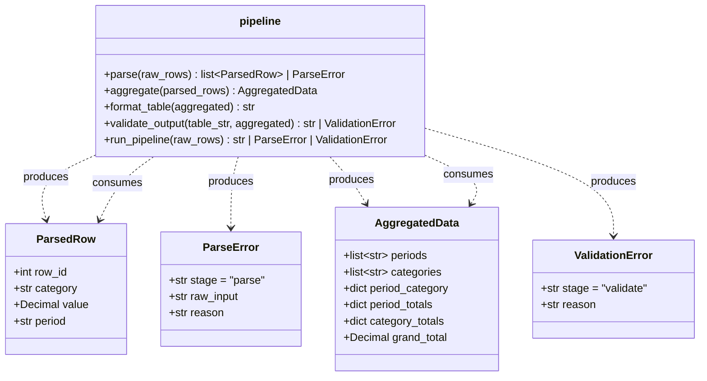

# Evaluation Supplementary Report

---

## 1. Solution Summary

The agent built a Python module `report_pipeline` implementing a four-stage text report formatting pipeline.

### Class / Module Diagram

### What Was Built

- **`parse()`**: Reads `ROW_ID:CATEGORY:VALUE:PERIOD` strings, validates field count, ROW_ID (positive integer), CATEGORY (REVENUE/COST/HEADCOUNT), VALUE (decimal, non-negative for REVENUE and HEADCOUNT), PERIOD (YYYY-Q1..Q4 regex). Returns `list[ParsedRow]` or `ParseError`.
- **`aggregate()`**: Groups by (period, category), sums values, computes per-period totals, per-category totals, and a grand total. Periods sorted chronologically, categories in REVENUE→COST→HEADCOUNT spec order.
- **`format_table()`**: Plain-text table with right-aligned values; HEADCOUNT as integers; REVENUE/COST as `$1,234.56` (negative as `-$200.00`); column widths sized to widest content including header; 2-space padding between columns.
- **`validate_output()`**: Checks all periods appear in the table header, TOTAL column is present, category totals match arithmetic sum, grand total matches sum of period totals.
- **`run_pipeline()`**: Chains all four stages, returning the first error or the formatted table string.

**Final test results:** 43 tests, **100% line coverage**, all passing.

---

## 3. Test Quality Analysis

### Meaningfulness of Tests and Assertions

**Positive:** Tests are highly specific and meaningful:
- `test_parse_error_wrong_field_count` checks `result.stage == "parse"` and `result.raw_input == bad` and `"4" in result.reason` — all three attributes are verified against specific values.
- `test_aggregate_periods_chronological_order` checks exact ordering `["2023-Q4", "2024-Q1", "2024-Q2"]`.
- `test_format_multiple_periods_in_header` checks both presence and relative order with `header.index()` comparisons.

**Minor issue:** `test_parse_error_negative_headcount` has a duplicate assertion: `assert isinstance(result, ParseError)` appears twice. This is harmless but slightly sloppy.

### Test Readability and Expressiveness

Names are descriptive and follow a clear `test_<stage>_<behavior>` pattern. The separation into stage-specific files (`test_parse.py`, `test_aggregate.py`, `test_format.py`, `test_validate.py`, `test_pipeline.py`) is excellent for navigation and comprehension.

The `make_agg()` helper in `test_format.py` and `test_validate.py` reduces boilerplate for constructing `AggregatedData` objects without hiding test intent. The `_rows()` helper in `test_aggregate.py` similarly provides concise test data setup. Both are well-designed.

### Tests as Clients vs. Internal Knowledge

Tests interact through the public API (functions imported from `report_pipeline`). They do not access private helpers like `_valid_period` or `_period_sort_key`. However, the format and validate tests construct `AggregatedData` directly (using `make_agg`), which requires knowing the data structure's fields. This is appropriate since `AggregatedData` is part of the public contract.

The validate tests exercise some interesting combinations: providing intentionally inconsistent `AggregatedData` objects (where `category_totals` contradicts `period_category`) to trigger validation errors. This tests the validation logic honestly without mocking.

### Test Data Realism and Coverage

- Parse tests use realistic strings like `"1:REVENUE:1000.00:2024-Q1"` with deliberate variations for boundary cases.
- All CATEGORY types are tested (REVENUE, COST, HEADCOUNT).
- Negative values are tested for COST (valid), REVENUE (invalid), HEADCOUNT (invalid).
- Invalid periods cover both format violation (`2024-01`) and out-of-range quarter (`2024-Q5`).
- Multi-period aggregation is tested.
- Format tests include edge case of very small values (`$1.00`) to confirm column width respects header width.
- The `test_validate_period_in_body_but_not_header` test cleverly crafts a malformed table where the period string appears in the body but not the header line — a realistic check for the specific branching logic.

### Mock Usage

No mocks are used anywhere. All tests exercise real implementations end-to-end within their stage. This is appropriate given the pipeline's pure-function nature.

### Issues and Concerns

1. **Validate tests construct inconsistent AggregatedData objects**: Tests like `test_validate_mismatched_category_total_returns_error` manually set `category_totals={"REVENUE": "9999.00"}` but `period_category={(..."REVENUE"): "1000.00"}` — this creates an artificial inconsistency that only exists because the test builds data by hand. In practice, `aggregate()` would never produce such inconsistency. This is fine for black-box testing of `validate_output()` but reveals that the validator checks consistency against the `AggregatedData` itself (not the table numbers), which limits the real-world usefulness of the validation.

2. **`test_format_column_no_narrower_than_header`**: Tests that a 7-character slice of the revenue line is 7 chars long — this will always be true as long as the string is ≥ 7 chars at that position, regardless of alignment. It's a somewhat brittle way to check the column width invariant.

3. **Coverage-driven tests (Test 12)**: The final batch was explicitly driven by uncovered lines in the coverage report. While this achieves 100% coverage, some of these tests (e.g., `test_validate_empty_table_no_periods_returns_error`) feel contrived to hit a specific branch rather than testing a meaningful use case.

4. **No test for multiple TOTAL checks in pipeline**: The pipeline test is minimal (4 tests), testing only success and parse error propagation, with no test for `ValidationError` propagation through `run_pipeline`.

### Overall Assessment

The tests are of **good quality**: well-organized, meaningfully named, covering both happy paths and error paths with realistic data. The use of helper functions shows good test design thinking. The main weaknesses are:
- Some coverage-hunting tests at the end are slightly contrived
- Minor redundant assertion in one test
- The validate tests are testing consistency of `AggregatedData` with itself (which `aggregate()` would maintain by construction), limiting their real-world usefulness

Despite these concerns, the solution is complete, correct, and well-tested.
